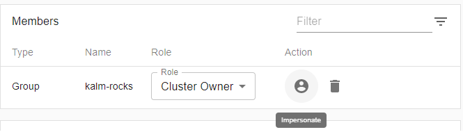

To test and verify that user and group permissions are setup properly, Kalm comes with an "Impersonate" feature. In any of the Members sections, you can click the **impersonate** button to see what the user/group/access-token has access to within Kalm. As long as you are in a **Cluster Owner** role, you can impersonate any entity within Kalm.

To impersonate an entity when sending requests to kalm-api, simply add the corresponding impersonation info into the `Kalm-Impersonation` section of the header.
