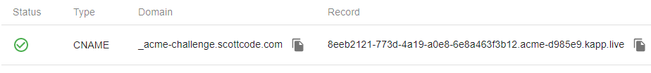

## Overview

Kalm can help you create certificates via Let's Encrypt. This article provides an overview of how certificates are obtained, including extra details on complexities regarding issuance and renewal of **wildcard** certificates.

## Obtaining a (non-wildcard) certificate

When requesting a certificate from Let's Encrypt, you must complete a "challenge" to prove that you are in control of the domain(s) to be certified. There are multiple types of challenges. Typically we can just use **HTTP-01**, which is the most common and simplest challenge type.


### HTTP-01

Let's Encrypt generates a random token, which you must serve at a specific url:

```
http://<YOUR_DOMAIN>/.well-known/acme-challenge/<TOKEN>
```

This proves that you have permission to serve files(and are therefore in control of) <YOUR_DOMAIN>

### How it works in Kalm

Kalm automates most of this process, all you have to do is point <YOUR_DOMAIN> to the IP of the Kalm cluster. For example, if <YOUR_DOMAIN> is **myapp.com** and the cluster IP is **34.84.45.1**, you would add the following DNS record.

| Type | Host      | Answer    |
| ---- | --------- | ---------- |
| A    | myapp.com | 34.84.45.1 |

Then you can initiate the certificate obtaining process in the Kalm UI by following [this guide](https-certs). Behind the scenes, Kalm does the necessary work to ensure that the token is accessible via the specified URL, then tells Let's Encrypt to initiate the challenge.

## Obtaining a wildcard certificate

The process used to obtain a wildcard certificate is similar to a normal certificate in that you have to complete a challenge to prove you have control over the domain. However, Let's Encrypt doesn't support the HTTP-01 challenge for wildcard certificates. You must instead complete a **DNS-01** challenge.

### DNS-01

Instead of serving a token on your webserver, the DNS-01 challenge asks you to put a specific value in a TXT record under the domain name you are trying to certify.

To complete the challenge, you could manually add an entry to your DNS provider:

| Type | Host                       | Answer        |
| ---- | -------------------------- | -------------- |
| TXT  | \_acme-challenge.myapp.com | <RANDOM_TOKEN> |

However, depending on your DNS provider's API you may not be able to **automatically renew** this certificate. Instead a common solution is to delegate the DNS lookup to a **Validation-specific DNS Server**. Kalm provides a validation-specific DNS Server out of the box for this exact usecase.

### Configuring the Validation-specific DNS Server

When you attempt to create a wildcard certificate for the first time, Kalm will initialize a Validation-specific DNS Server on your cluster at a randomly generated subdomain. For example, if your cluster domain is mycluster.com, the Validation-specific DNS server resides in:

```
acme-d985e9.mycluster.com
```

The Validation-specific DNS Server contains 2 entries created by default.

| Type | Host                         | Answer                      |
| ---- | ---------------------------- | ---------------------------- |
| A    | ns.acme-d985e9.mycluster.com | 34.84.45.105                 |
| NS   | acme-d985e9.mycluster.com    | ns.acme-d985e9.mycluster.com |

The A record indicates that there is a DNS server ns.acme-d985e9.mycluster.com located at 34.84.45.105.

The NS record indicates that the DNS server ns.acme-d985e9.mycluster.com is responsible for answering all DNS queries to the domain acme-d985e9.mycluster.com, including nested subdomains \*.acme-d985e9.mycluster.com

### Creating Wildcard domains

With the Validation-specific DNS Server running, we can complete DNS-01 challenges and create wildcard certificates.

Let's say we want to obtain a wildcard certificate for:

```
*.myapp.com
```

We can create a new certificate in Kalm. At this point, Kalm will generate a unique challenge URL that is capable of passing the DNS-01 challenge. The challenge URL is shown in the Certificate details page:



This table indicates that the challenge for **\*.myapp.com** can be answered by **b6e4682c-5109-4a34-ac99-d5097d5b2b68.acme.mycluster.com**.

Thus, in order to create a wildcard certificate for myapp.com, all we need to do is add a CNAME record at the DNS provider of myapp.com

| Type  | Host                           | Answer                                                  |
| ----- | ------------------------------ | ------------------------------------------------------- |
| CNAME | **\_acme-challenge.myapp.com** | b6e4682c-5109-4a34-ac99-d5097d5b2b68.acme.mycluster.com |

_*Note - some DNS management interfaces automatically include your domain (".myapp.com" in the above example) at the end of the Host. In this case, only include the first portion of the Host and omit the rest of the domain (Host = "\_acme-challenge")_

From this point on, Kalm tells Let's Encrypt to initiate the challenge. The following steps occur:

1. Let's encrypt will make a request to **\_acme-challenge.myapp.com**
2. The request gets forwarded to **b6e4682c-5109-4a34-ac99-d5097d5b2b68.acme.mycluster.com** due to the CNAME record
3. The TXT record for **b6e4682c-5109-4a34-ac99-d5097d5b2b68.acme.mycluster.com** is the secret token (served by the Validation-specific DNS server)
4. The challenge passes and the certification process proceeds normally.

### Certificate Renewal

As long as the CNAME record at your DNS provider is kept intact, the path will work for future challenges as well. This means Kalm can automatically renew wildcard certificates before they expire.

#### Wildcard Cert Issuing Flow


_Note: This flowchart is hard to follow, should redraw a simpler version with bigger text._
