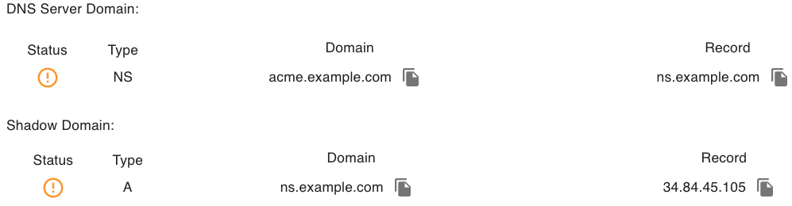
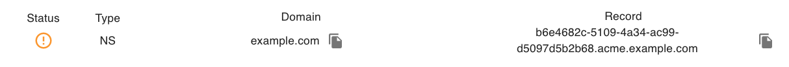
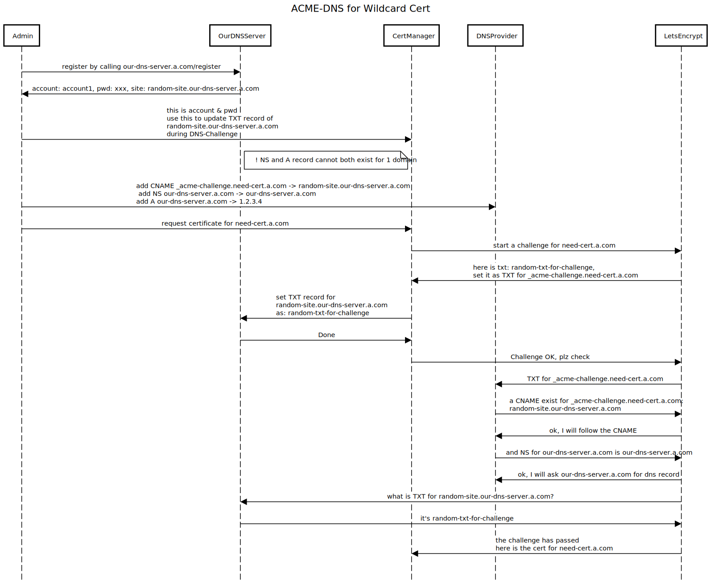

## Overview

Kalm uses Cert-Manager to pass the "challenges" from Let’s-Encrypt to issue HTTPS certificates.

## How Certificate Issuing works

When trying to get a certificate from Cert Authorities like Let’s-Encrypt, the CA validates that you controll the domains in the certificate request using "challenges". There are two kinds of challenges:

- HTTP-01
- DNS-01

Though details are different, the basic idea of these two is similar: the CA generates some random texts, and you prove your ownership of the domains by putting the texts at specific locations, for HTTP-01, it is a url under that domain, for DNS-01, it is a DNS record at `_acme-challenge.<YOUR_DOMAIN>`.

## How it works in Kalm

Kalm supports both HTTP-01 and DNS-01, if Kalm finds wildcard domain in Cert Request, it uses DNS-01, otherwise, HTTP-01.

### HTTP-01

todo

### DNS-01

For DNS-01 challenge, after Let’s-Encrypt generates a token, Kalm will start a DNS server and serve TXT DNS records derived from that token at `_acme-challenge.<YOUR_DOMAIN>`. Then Let’s-Encrypt will query the DNS system for that record. If it finds a match, you can proceed to issue a certificate!

Suppose we submit a certificate request for: `*.example.com`. After submit this first wildcard certificate request at Kalm dashboard, Kalm will start a DNS server, in order to make the DNS server publicly known. Two things need to be done:

1. choose domains for our DNS server to be accessed publicly.
2. configure the chosen domains at your DNS provider.

to keep the workflow simple, Kalm finishes the first thing by auto picking up 2 random sub-domains for the newly started DNS service based on the domain in the cert. of course, you can update the domains if you like. below, I update the domains to make it easier for read:

| Domain           | Description                                                                                                                                                                                                       |
| ---------------- | ----------------------------------------------------------------------------------------------------------------------------------------------------------------------------------------------------------------- |
| ns.example.com   | this is the domain for our DNS server.                                                                                                                                                                            |
| acme.example.com | sub-domains like `b6e4682c-5109-4a34-ac99-d5097d5b2b68.acme.example.com` will be generated based on this one, and our DNS server will serve the TXT DNS record on these sub-domains to pass the DNS-01 challenge. |

to finish the second thing, you need to add 2 DNS records at your dns provider:

| Type | Name             | Content        |
| ---- | ---------------- | -------------- |
| A    | ns.example.com   | 34.84.45.1     |
| NS   | acme.example.com | ns.example.com |

basically these two records are saying:

- I have a dns server `ns.example.com` located at given IP (the A record).
- and it's responsible to answer all the DNS queries for the domain: `acme.example.com` and all it's sub-domains: `*.acme-random.example.com`.

Now, we have setup a DNS server and it is ready to pass the DNS-01 challenges.

For the wildcard certificate we submit at the beginning, Kalm will generate a unique address to answer the DNS challenge, as the pic showed below:

The warning status in picture showed us:

> please add an CNAME record with your dns provider, **example.com** CNAME **b6e4682c-5109-4a34-ac99-d5097d5b2b68.acme.example.com**

We need add a CNAME DNS record at our DNS provider now:

| Type  | Name                             | Content                                               |
| ----- | -------------------------------- | ----------------------------------------------------- |
| CNAME | **\_acme-challenge.example.com** | b6e4682c-5109-4a34-ac99-d5097d5b2b68.acme.example.com |

The CNAME record is just saying: go to our dns server to get the TXT DNS record for the DNS-01 challenge, and

When Let’s-Encrypt checks if we have meet the challenge it proposed, for domain:`example.com`, Let’s-Encrypt will look for TXT DNS record for `_acme-challenge.example.com`. as we have add the CNAME record for the domain, it will follow the CNAME and go to `b6e4682c-5109-4a34-ac99-d5097d5b2b68.acme.example.com`, as Kalm orchestrates the cert-manger and the dns server, the TXT record is properly set there. After Let's-Encrypt find the match, the challenge is passed and the certificate will be issued.

After issuing the cert, keep the DNS records at your dns provider, so that kalm can auto renew the certificates before it expire in the future.

#### Wildcard Cert Issuing Flow

