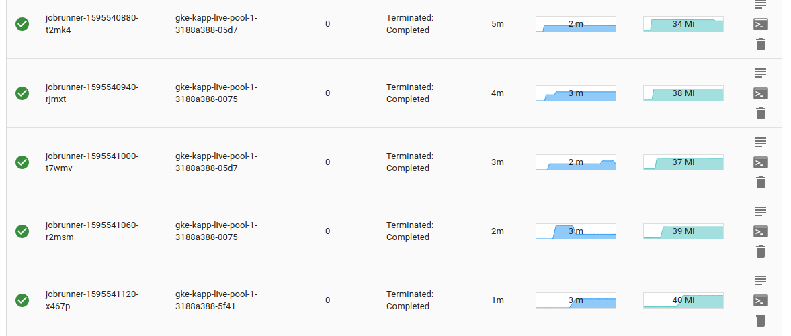

- create new application
- create new component
- select `busybox` as the image
- select `Cronjob` as Workload Type
- enter `* * * * *` (every minute) for Cronjob Schedule
- enter `/bin/sh -c 'echo performing a job'`

- click `Deploy Component`

You should see a list of jobs appearing 1 minute apart, with `Terminated: Completed` Status

