Let's go through a simple example of deploying a single pod holding an nginx container.

This tutorial will teach you:

- The basics of how Kalm organizes deployments into applications
- How to create application configurations
- How to open a port and direct traffic to an application

<figure className="video_container">
  <iframe width="560" height="315" src="https://www.youtube.com/embed/fzig4AvMr74" frameBorder="0" allowFullScreen={true}> </iframe>
</figure>

## Step 1: Create Application

The main page of Kalm shows a list of applications. Press the **Add Application** button

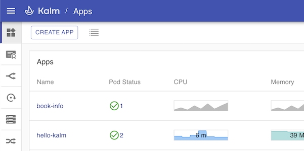

Enter a name for your application, then press **Create Application**

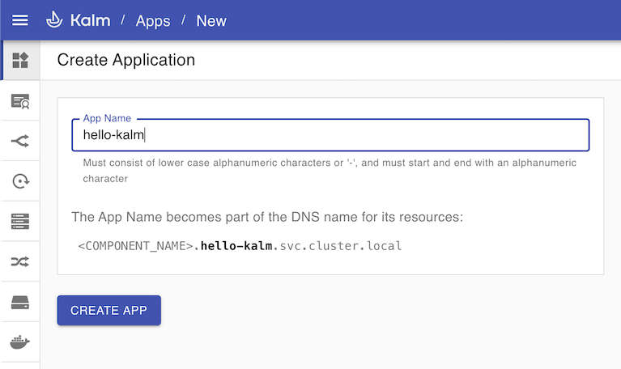

<br />

## Step 2: Create Component

An application is made of one or more _components_. Each component typically holds a docker image. In this example, we will create a component which contains the official <a href="https://hub.docker.com/_/nginx" target="_blank">nginx image</a>

Under the Basic Information section, enter a name such as _"webserver"_ into the **Name** field and **_nginx:alpine_** into the **Image** field. Leave all other fields as is and click **Deploy Component**.

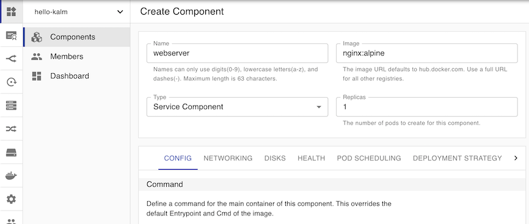

After a few seconds, a single Pod holding the nginx:alpine image will be deployed to your cluster.

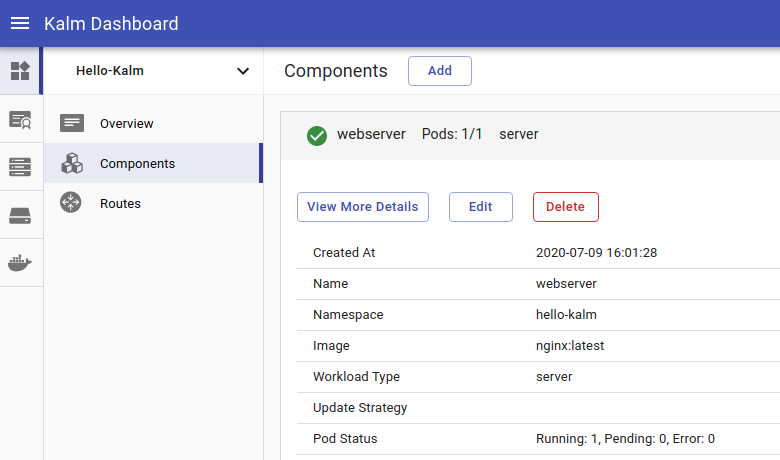

<br />

## Step 3: Examining and Updating

Let's examine our pod to see if nginx is deployed. Kalm provides a handy terminal for quick examinations. Open a shell to our pod by clicking on the shell icon.


Run a few commands, for example:

```
cd /etc/nginx
ls
cat nginx.conf
```

It seems that nginx is correctly installed!

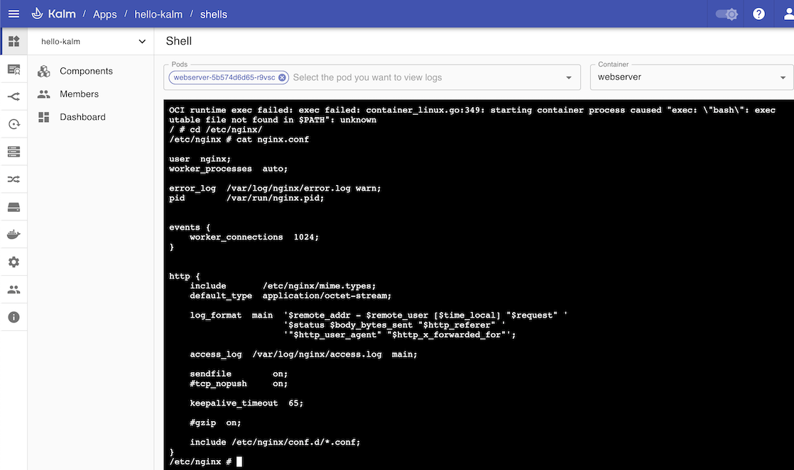

Next let's go back to the Components list by clicking on **Components** in the navigation sidebar.

Currently one pod is running. Let's scale up our application. Click the **Edit** button.

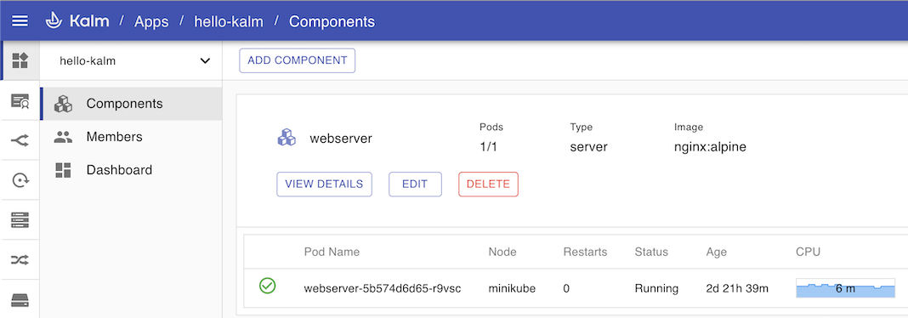

Change the number of replicas to **3** and click Deploy.

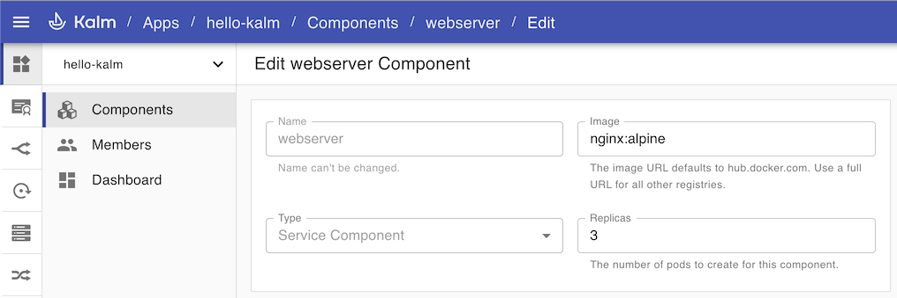

After a few moments, there should be three pods running.

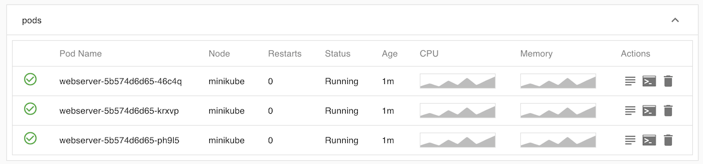

Kubernetes is declarative, which means you specify the end result("I want 3 pods"), and the Kubernetes control plane figures out how best to achieve the end result for you("let's add 2 more").

## Step 4: Ports and Routing

Let's make our application accessible in the browser. We can do this by opening a port on our component, then adding a route to it.

First we'll open a port. Once again, we'll go the components area and click on **Edit**, then click on the **Networking** tab.

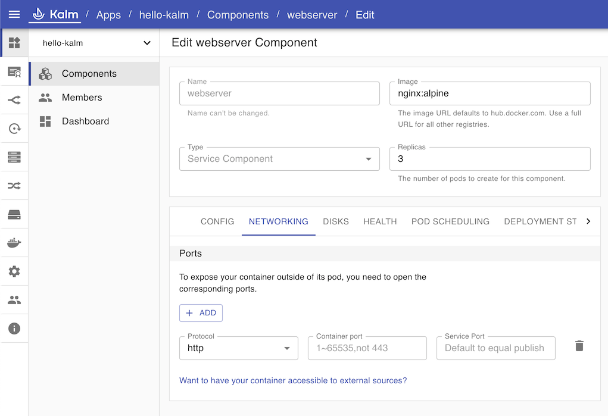

To open a port, we need to specify a `Container Port` and a `Service Port`. Kalm tries to be helpful by providing a visual reminder of which is which.

The Container port should be **80** because its what the `nginx:alpine` image defaults to. The Service port can be an arbitrary port of your choosing, such as **8080**.

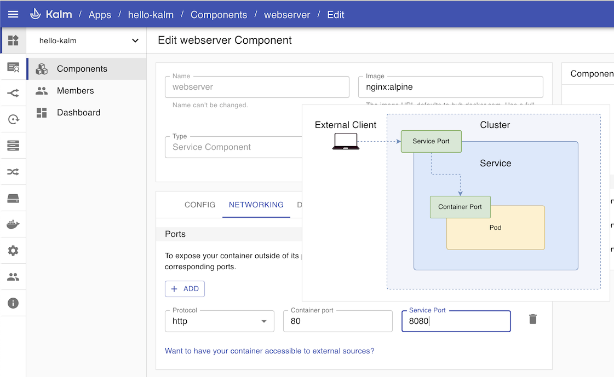

Click **Deploy** to apply changes.

:::note
During the deployment you may notice that the number of pods temporarily exceeds three. Kalm by default uses `rolling update`, which means pods are incrementally added and removed one by one, resulting in zero downtime.
:::

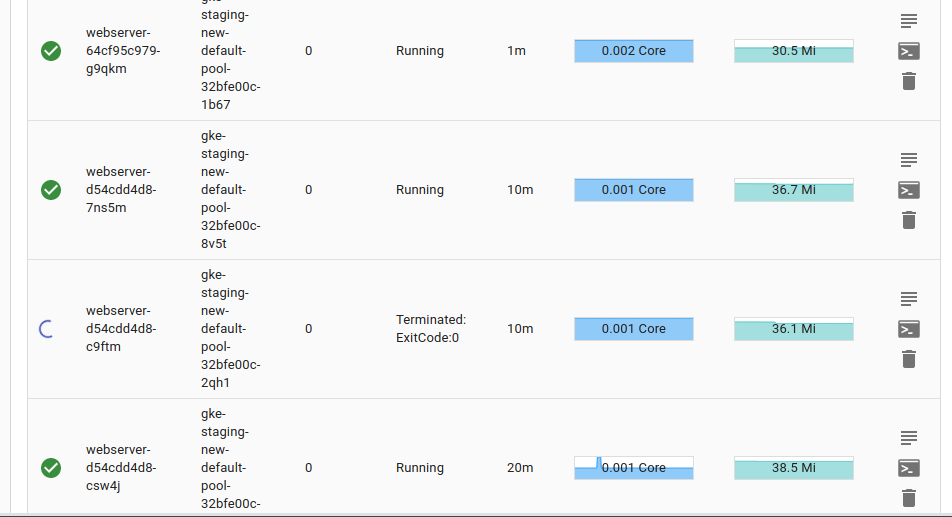

<br />

Now that the port is open, let's add a route. Click **Routes** in the navigation sidebar tab, then click **Add Route**


The cluster ip address should be displayed under the Hosts field. Enter this address in the **Hosts** field.

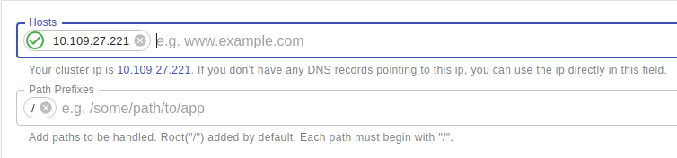

:::note
For minikube, if no ip is shown, run `minikube tunnel` and refresh the page.
:::

In the _Targets_ section, select our _"webserver"_ component from the dropdown.

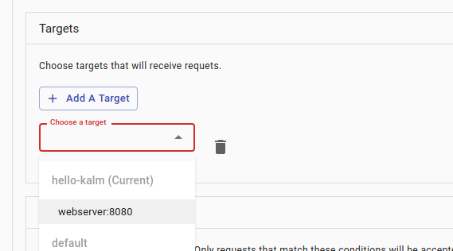

Click **CREATE ROUTE**. Our route is now completely setup.

There should be a new entry in the Routes table. Click on the link in the _Domain_ column to open our app in a new browser tab.

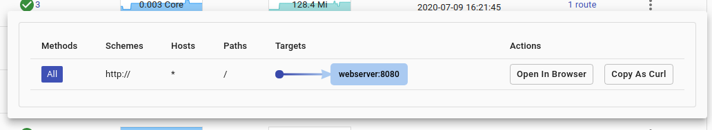

Great, our nginx webserver app is working!

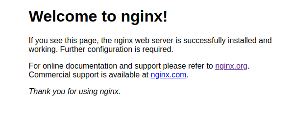

You've just installed an application on your cluster, modified it, scaled it, and setup routing to make it accessible from the outside world!

All the heavy lifting is done via Kubernetes and istio. Kalm is simply applying the appropriate configurations to your cluster. In fact anyone with familiarity with Kubernetes should be able to create the same application configuration with a text editor and `kubectl`. We encourage this as an _exercise for the reader_.

## Next Step

Admittedly our "application" is rather trivial. In the next tutorial, let's go over a more representative application containing multiple microservices working together.
