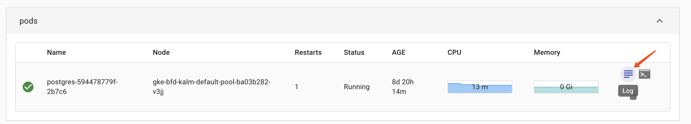
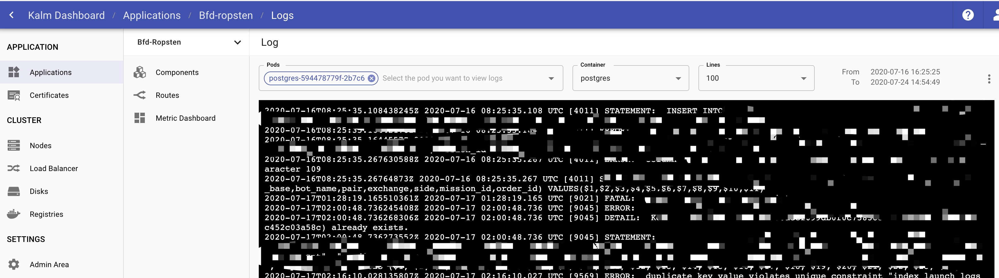
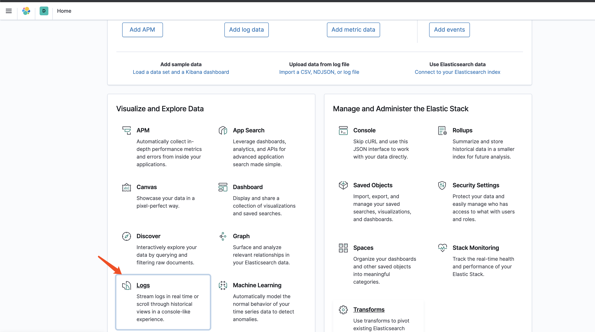
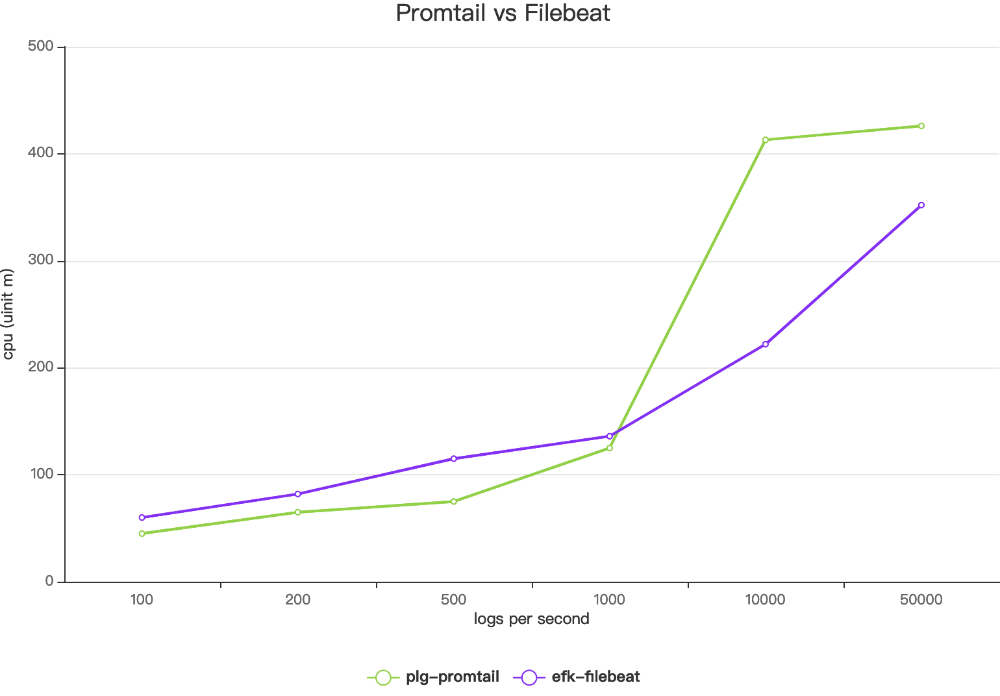
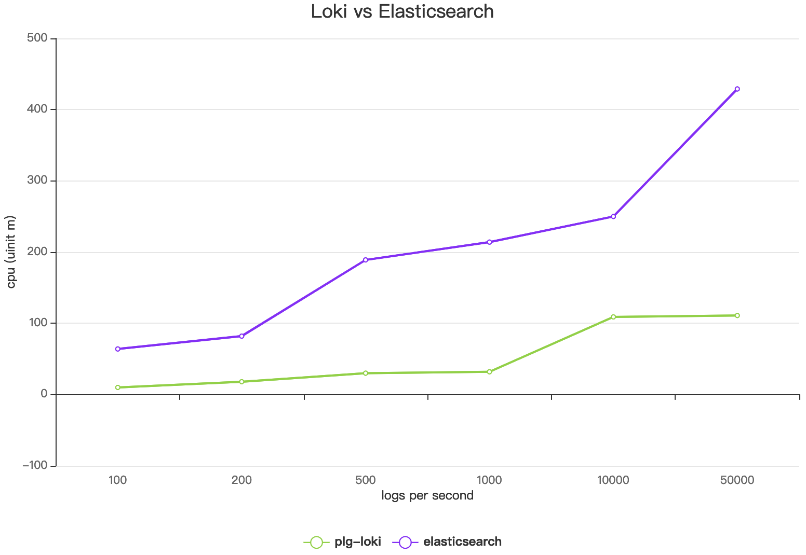

KALM provide  a simple log board for component, you can view component’s logs in this board. 





For production environment, the features of log board is obviously not enough. Usually, we need a logging system to collection, pipeline, query, analysis logs.

EFK (Elasticsearch) and PLG (Loki) were the most popular logging system of the moment. They have their own advantages.

## Using PLG on KALM

### Prerequisites

Make sure KALM installed to your cluster.
Make sure you have ***kubectl*** and configure to your cluster.

### Install PLG on KALM

Run the following command to install plg.

```
$ kubectl apply -f https://github.com/kalmhq/kalm/blob/master/resources/kalm-install-plg.yaml
```

### View & Query logs

```
$ kubectl -n loki port-forward $(kubectl get pods -n loki -l app=grafana -o jsonpath="{.items[].metadata.name}") 3000:3000

```

Open [http://localhost:3000](http://localhost:3000/login) in browser, and use ‘*admin’* and ‘*password’ to login.*
Jump to view logs for [grafana pod](http://localhost:3000/explore?orgId=1&left=[%22now-1h%22,%22now%22,%22Loki%22,{%22expr%22:%22{job=\%22loki/grafana\%22}%22},{%22mode%22:%22Logs%22},{%22ui%22:[true,true,true,%22none%22]}]).


We can enter more complex query statements in the input field. For more LogQL in [here](https://github.com/grafana/loki/blob/v1.5.0/docs/logql.md).

### Persistence and retention and for PLG

By default, we set up a 10Gi disk to store logs to loki, you can reset to a suitable value for you system.

Logs in loki will never be deleted by default. For some reason, we need to delete logs that have existed for a long time. See [more configuration about retention of logs](https://github.com/grafana/loki/blob/master/docs/sources/configuration/_index.md#table_manager_config).

### PLG documentation

For more informations of PLG, see https://github.com/grafana/loki/blob/master/docs/README.md.


## Using EFK on KALM

### Prerequisites

Make sure KALM installed to your cluster.
Make sure you have ***kubectl*** and configure to your cluster.

### Install EFK on KALM

Run the following command to install EFK.

```
$ kubectl apply -f https://github.com/kalmhq/kalm/blob/master/resources/kalm-install-efk.yaml

```

### View & Query logs

```
$ kubectl -n efk port-forward $(kubectl get pods -n efk -l app=kibana -o jsonpath="{.items[].metadata.name}") 5601:5601

```

Open [http://localhost:5601](http://localhost:5601/) in browser.
Jump to view logs for [kibana](http://localhost:5601/app/logs/stream).



You can use [KQL](https://www.elastic.co/guide/en/kibana/master/kuery-query.html) to query logs.


### Persistence and retention and for EFK

By default, we set up a 30Gi disk to store logs for elasticsearch, you can reset to a suitable value for you system.

You can configure index lifecycle management (ILM) policies to automatically manage indices according to your performance, resiliency, and retention requirements. For example, you could use ILM to:

* Spin up a new index when an index reaches a certain size or number of documents
* Create a new index each day, week, or month and archive previous ones
* Delete stale indices to enforce data retention standards

 See [more informations about ILM](https://www.elastic.co/guide/en/elasticsearch/reference/7.8//index-lifecycle-management.html).

### EFK documentation

For more informations of EFK, see [https://github.com/grafana/loki/blob/master/docs/README.md](https://www.elastic.co/guide/index.html).

## Performance

We do some performance test for PLG and EFK. 

### cluster info:
- gke version: 1.16.11-gke.5
- node count: 3
- node machine type: n2-standard-4 (4 core cpu, 16G memory)

### plg info:
- promtail version: 1.5.0
- loki version: 1.5.0

### efk info:
- elasticsearch version: 8.0.0
- filebeat version: 8.0.0

### Test case:
We write logs as 100,200,500,1000,10000,50000 times per second (each log has 1000 characters), and write for 100 seconds.

### Test Result

#### Cpu





#### Memory

Memory of each pod was hardly change with the increase in logs.

- promtail <50Mi
- filebeat <50Mi
- loki <200Mi
- elasticsearch <1500Mi
