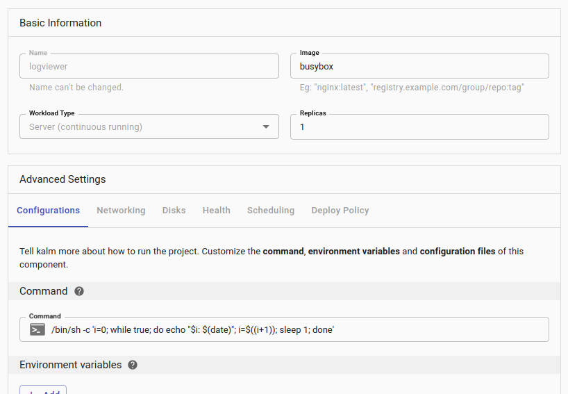
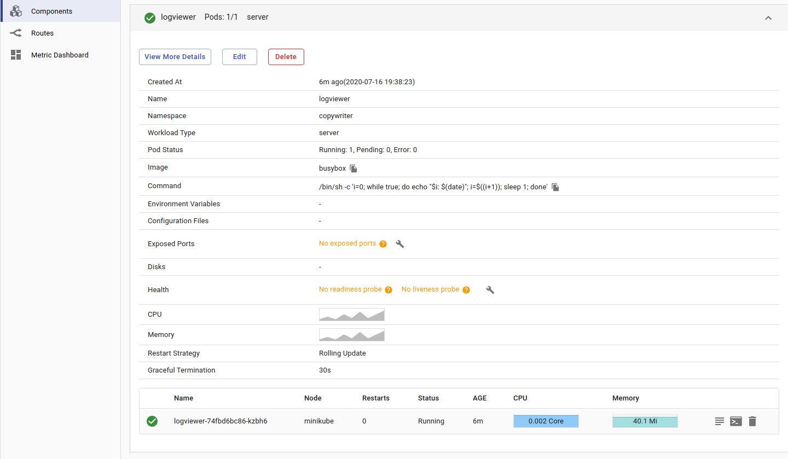

<figure className="video_container">
  <iframe width="560" height="315" src="https://www.youtube.com/embed/zMzWkzxIKlo" frameBorder="0" allowFullScreen={true}> </iframe>
</figure>

Sometimes its useful to view the log output of a particular container. Kalm provides a view to quickly view logs in the web:


## Example Container Setup

Let's create a container that logs output every second. Create a New Application, then Add a single Component named **logviewer** with the image set to **busybox**.

In the **Command** input box, enter the following command, which outputs a timestamp every second:

```
/bin/sh -c 'i=0; while true; do echo "$i: $(date)"; i=$((i+1)); sleep 1; done'
```



Click **Deploy** to instantiate the component container.

## View log

After deployment is complete, click the _Log Icon_:



<br />
You should see the Log View:


## Logging system

You may ask, can I only view my program logs one by one container? What if I want to view aggregated logs for a specific time period?

Don't worry, see if [Logging System](./logging/index) meets your needs.
