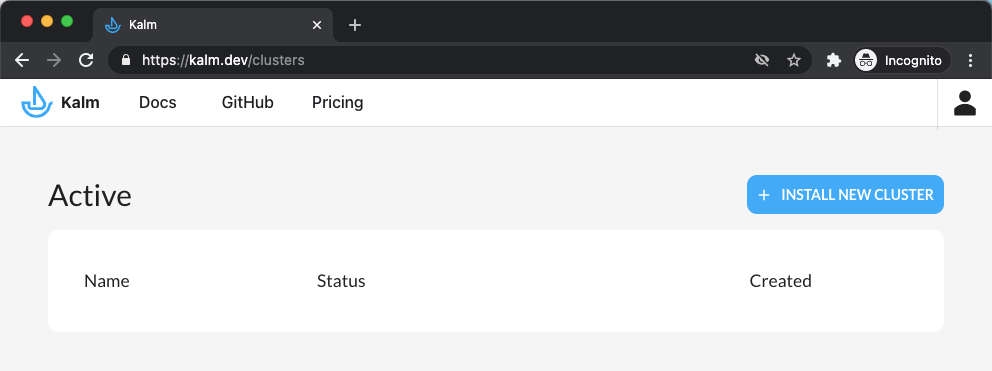
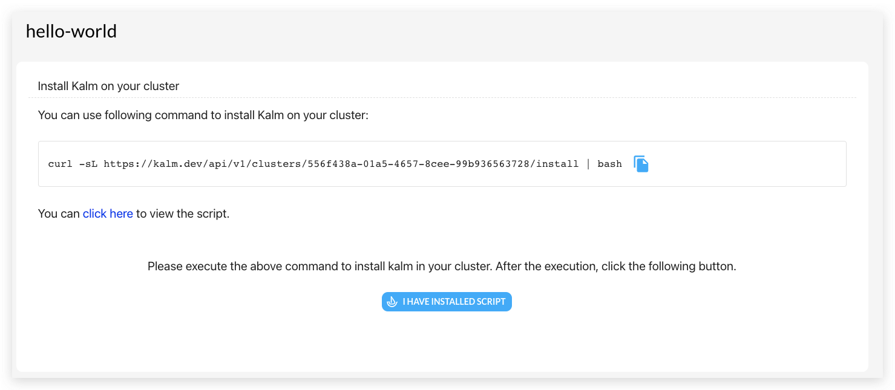
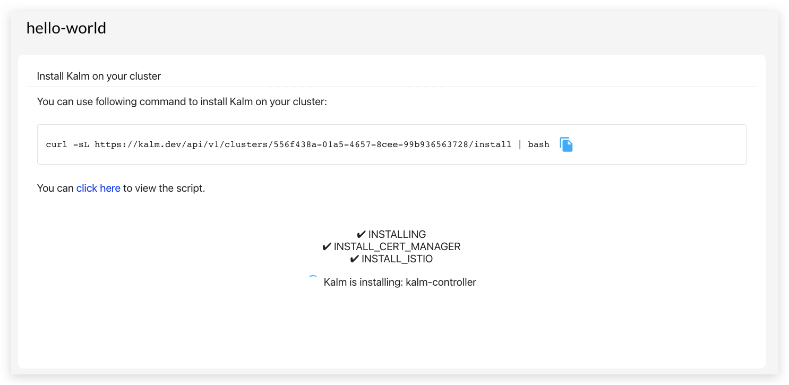
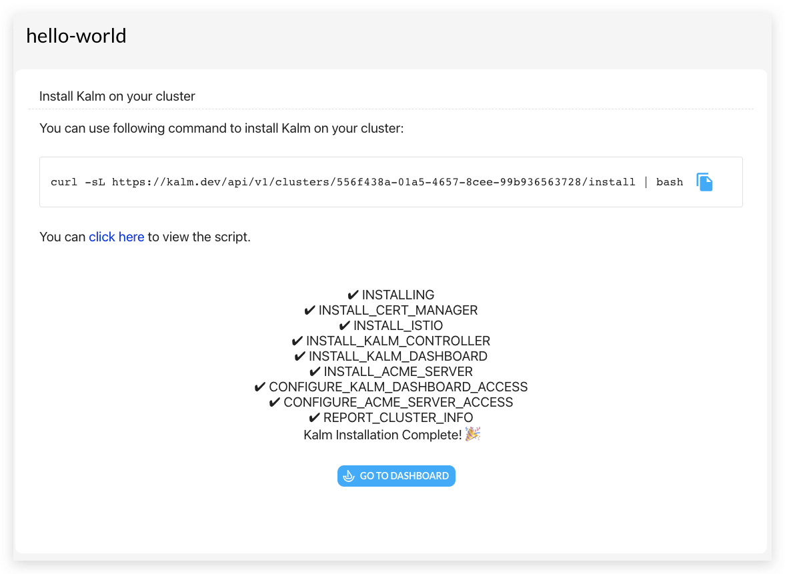

Welcome! This guide shows you how to install Kalm onto your Cluster. It should take less than 20 minutes. 

1. Go to [http://kalm.dev/signin](http://kalm.dev/signin), and authenticate with either Github or Google OAuth
2. Click **INSTALL NEW CLUSTER**

    

3. Choose a name for your cluster

4. Run the curl command to install Kalm on your cluster:

:::note
Make sure your `kubectl` is pointing to the cluster you want to install Kalm on. To see your current cluster, use `kubectl config get-context` - the selected cluster should be marked with a * in the output.
:::

The installation process will update while it installs:

_Usually this process takes around 5 - 15 minutes_

That's it! Once the installation finishes, click the GO TO DASHBOARD button to start using Kalm. [Kalm.dev](https://kalm.dev) by default will now point you to your cluster management dashboard.

