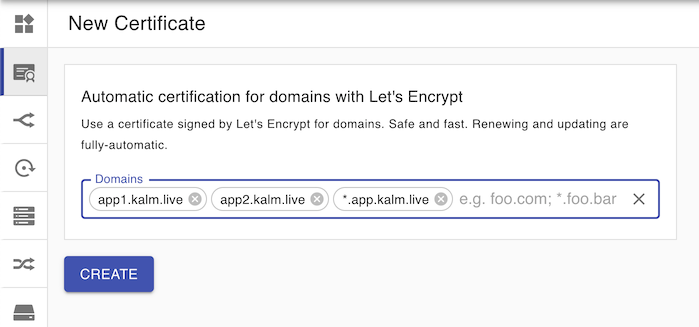
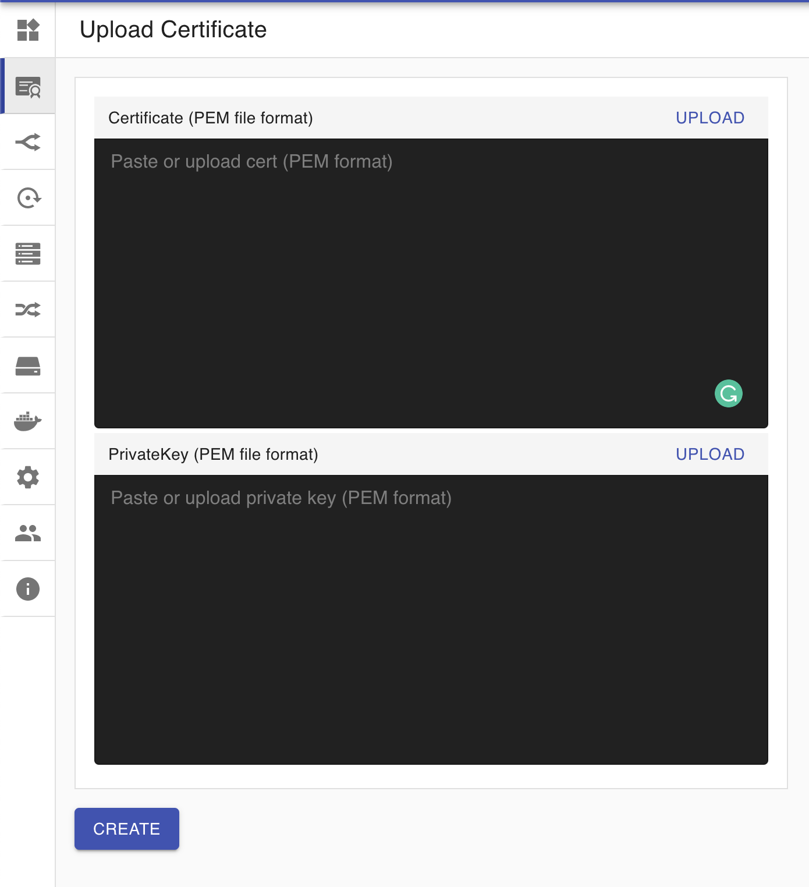
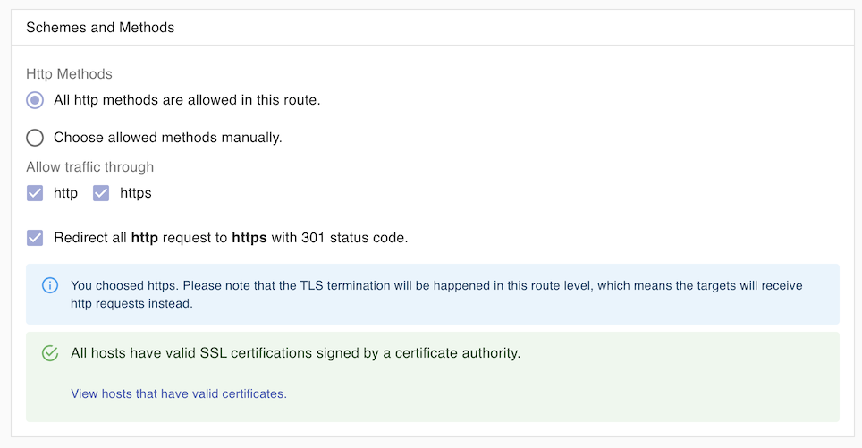

## Overview

To enable HTTPS access to your applications, you need a certificate from a Certificate Authority. Kalm can help you create new certificate via Let's Encrypt, or hook up existing ones. Domains with certificates managed by Kalm can be easily routed to any container on your cluster.

## Automated Certificates with Let's Encrypt

- Click **Certificates** in the Navigation Sidebar
- Click **New Certificate**
- The Certificate Creation page displays your cluster IP. You need to point domains you want to configure to this cluster IP by adding an A Record. (Specific instructions depends on your domain provider)

* Enter a **Certificate Name**
* Enter one or more domains in the **Domains** field. If any of the domains is wildcards domain, Kalm will launch ACME DNS Server to handle with [DNS-01 Challenge](./cert-issuing#dns-01)
* Click **Create Certificate**

## Upload Existing Certificate

If you want to use an existing certificate, click **Use an existing certificate** and paste your Certificate and Private Key.

## Additional Instructions

### Using Certified Domains in Routes

Domains which have certificates properly configured can be used in Routes to handle HTTPs traffic. See the [Routes Guide](/) for more details.

### Wildcard Certificates

We have plans to support wildcard certificates in the near future, and can suggest workarounds in the mean time. Email david@kalm.dev if you need this.
