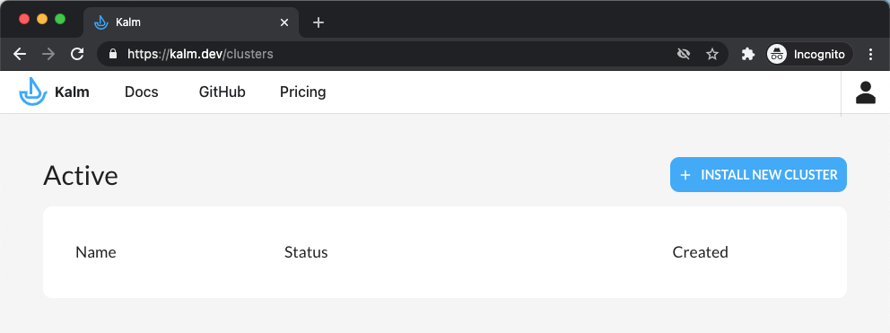
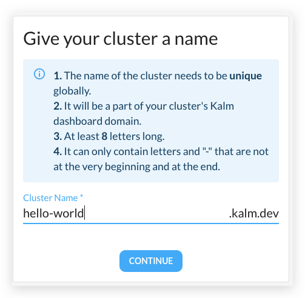
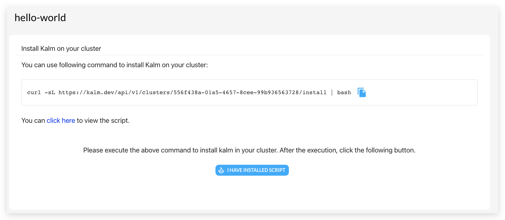
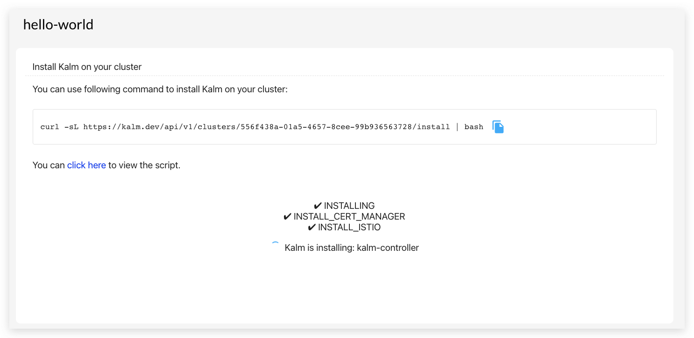
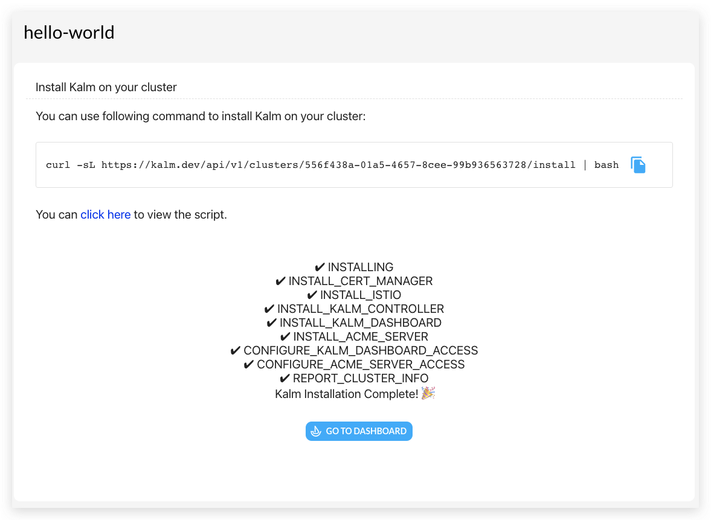

1. Go to [http://kalm.dev/signin](http://kalm.dev/signin)
2. After signing in, click the **INSTALL NEW CLUSTER** button in the upper right corner:

    

3. Choose a name for your cluster



4. Before running the install command, make sure your `kubectl` is pointing at the cluster for Kalm, run `kubectl config get-context`, the new cluster should be marked with a `*` in the output.

5.  Run the install script:



the install process will be updated during the execution:



usually the whole process took 15 - 30 minutes.

6. Once done, click the **GO TO DASHBOARD** button to start using Kalm.



# Troubleshooting

possible issues for each install step:

- INSTALL_CERT_MANAGER: Kalm is installing Cert-Manager, if this step stuck, very likely the cluster is having problems installing the pods, run `kubectl get pods -n cert-manager` to see if anything is going wrong, a normal running cluster should return something similiar as:

    ```bash
    ➜  kubectl get pods -n cert-manager
    NAME                                       READY   STATUS    RESTARTS   AGE
    cert-manager-7cb75cf6b4-48jvk              1/1     Running   0          29d
    cert-manager-cainjector-759496659c-7smnl   1/1     Running   0          29d
    cert-manager-webhook-7c75b89bf6-p9lwx      1/1     Running   0          29d
    ```

- INSTALL_ISTIO: Kalm is installing Istio, if this step stuck, very likely the cluster is having problems installing the pods, run `kubectl get pods -n istio-operator` and `kubectl get pods -n istio-system` to see if anything is going wrong, a normal running cluster should return something similar as:

    ```bash
    ➜  kubectl get pods -n istio-operator
    NAME                              READY   STATUS    RESTARTS   AGE
    istio-operator-7654b568b7-nqclz   1/1     Running   0          16d

    ➜  kubectl get pods -n istio-system
    NAME                                   READY   STATUS    RESTARTS   AGE
    istio-ingressgateway-59cf75bf7-hqpkd   1/1     Running   0          16d
    istiod-59cc49f5d9-cmzwb                1/1     Running   0          16d
    prometheus-6c77954d87-wmrpn            1/1     Running   0          16d
    ```

- INSTALL_KALM_CONTROLLER: Kalm is installing kalm-controller, if this step stuck, very likely the cluster is having problems installing the pods, run `kubectl get pods -n kalm-system -l control-plane=controller` to see if anything is going wrong, a normal running cluster should return something similar as:

    ```bash
    ➜  kubectl get pods -n kalm-system -l control-plane=controller
    NAME                               READY   STATUS    RESTARTS   AGE
    kalm-controller-758c5498c9-6vtp7   3/3     Running   0          110m
    ```

- INSTALL_KALM_DASHBOARD: Kalm is installing the Kalm dashboard, if this step stuck, very likely the cluster is having problems installing the pods, run `kubectl get pods -n kalm-system -l kalm-component=kalm` to see if anything is going wrong, a normal running cluster should return something similar as:

    ```bash
    ➜  kubectl get pods -n kalm-system -l kalm-component=kalm
    NAME                    READY   STATUS    RESTARTS   AGE
    kalm-6654df4b5c-w88cv   2/2     Running   0          121m
    ```

- INSTALL_ACME_SERVER: Kalm is installing the ACME DNS server, if this step stuck, very likely the cluster is having problems installing the pods, run `kubectl get pods -n kalm-system -l kalm-component=acme-server` to see if anything is going wrong, a normal running cluster should return something similar as:

    ```bash
    ➜  kubectl get pods -n kalm-system -l kalm-component=acme-server
    NAME                           READY   STATUS    RESTARTS   AGE
    acme-server-5f9f786f58-89tgl   2/2     Running   0          125m
    ```

- CONFIGURE_KALM_DASHBOARD_ACCESS: Kalm is waiting for Cloud Provider to assign a public Load Balancer for our Kalm dashboard, use `kubectl describe services -n istio-system istio-ingressgateway` to check the details of our service for the dashboard. Normally the cloud provider will assign a public IP or domain for our service. run `kubectl get services -n istio-system istio-ingressgateway -ojsonpath='{.status}'` to check out the info.

    ```bash
    ➜  kalm-cloud git:(main) kubectl get services -n istio-system istio-ingressgateway -ojsonpath='{.status}'
    {"loadBalancer":{"ingress":[{"hostname":"a8298a1a1a8ee473cbb923fa5de3576c-60911533.ap-northeast-1.elb.amazonaws.com"}]}}
    ```

    if the return result is empty, run `kubectl describe services -n istio-system istio-ingressgateway` to get related events of the service.

    ```bash
    ➜  kubectl describe services -n istio-system istio-ingressgateway
    Name:                     istio-ingressgateway
    Namespace:                istio-system
    ...
    Session Affinity:         None
    External Traffic Policy:  Cluster
    Events:                   ...
    ```

    The last section of the output: **Events** may show some related info about the reason why the assignment is not working, there are several possible reasons for the failure: wrong tags of the AWS VPC subnets, number of load balancers is out of quota, etc(see [https://aws.amazon.com/premiumsupport/knowledge-center/eks-load-balancers-troubleshooting/](https://aws.amazon.com/premiumsupport/knowledge-center/eks-load-balancers-troubleshooting/) for more details). It can also happen that the assignment silently fails without any warning events, in this case, it will be really hard to debug, and this is why we strongly suggest you to setup the EKS cluster using our recommend ways here: [https://www.notion.so/kalmhq/TODO-Install-on-EKS-60883f76fc8846babb6a1ccf2c6149df#d8127a07b43448c9af107693b20165c5](https://www.notion.so/kalmhq/TODO-Install-on-EKS-60883f76fc8846babb6a1ccf2c6149df#d8127a07b43448c9af107693b20165c5).

- CONFIGURE_ACME_SERVER_ACCESS: similar to CONFIGURE_KALM_DASHBOARD_ACCESS, this is Kalm waiting for Cloud Provider to assign a public Load Balancer for our ACME DNS server, use `kubectl get service -n kalm-system lb-svc-acme-server  -ojsonpath='{.status}'` and `kubectl describe service -n kalm-system lb-svc-acme-server` to see details of the service.

    ```bash
    ➜  kubectl get service -n kalm-system lb-svc-acme-server  -ojsonpath='{.status}'
    {"loadBalancer":{"ingress":[{"hostname":"xxx.elb.ap-northeast-1.amazonaws.com"}]}

    ➜ kubectl describe service -n kalm-system lb-svc-acme-server
    Name:                     lb-svc-acme-server
    Namespace:                kalm-system
    ...
    Session Affinity:         None
    External Traffic Policy:  Cluster
    Events:                   <none>
    ```

- REPORT_CLUSTER_INFO: Kalm is reporting cluster info like the public IPs and Domains the Cloud Provider just assigned to our to Kalm Cloud.
- CLUSTER_FULLY_SETUP: Kalm is waiting for the final setup of the cluster, the most time-consuming process is the issuance of the HTTPS certificate of our Kalm dashboard, which can take 10 - 15 minutes.