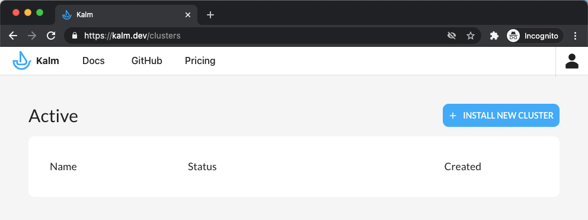
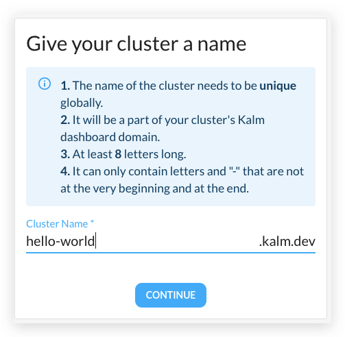
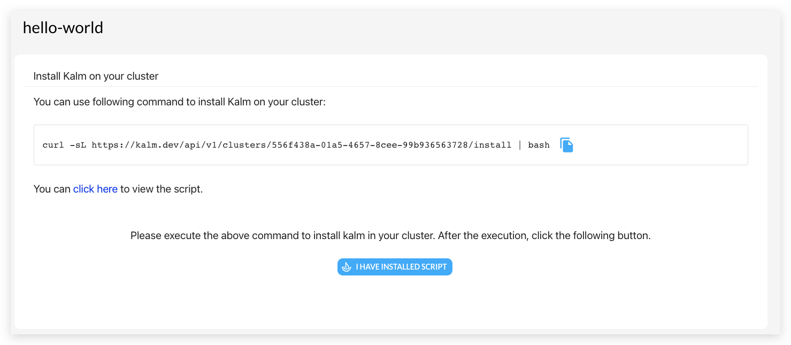
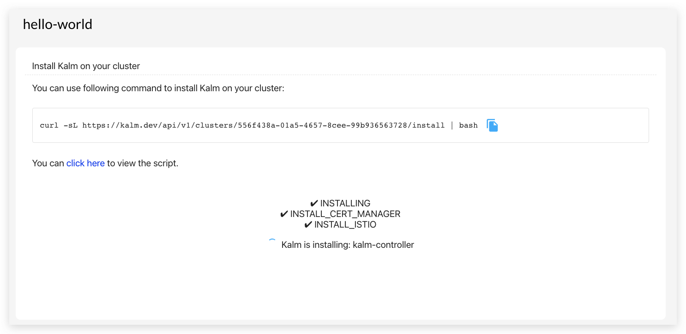
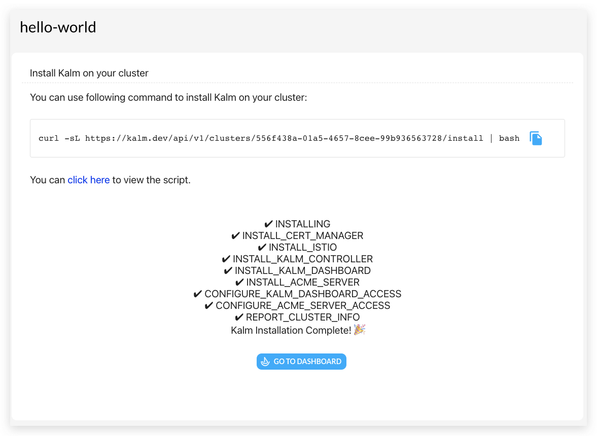

1. go to [http://kalm.dev/signin](http://kalm.dev/signin)
2. after sign in, click the **INSTALL NEW CLUSTER** button in the upper right corner:

    

3. choose a name for your cluster

4. run the command to install Kalm on your cluster:

:::note
to make sure your `kubectl` is pointing at the cluster for Kalm, run `kubectl config get-context`, the new cluster should be marked with a `*` in the output.
:::

the install process will be updated during the execution:

usually the whole process took 5 - 15 minutes.

5. once done, click the **GO TO DASHBOARD** button to start using Kalm

