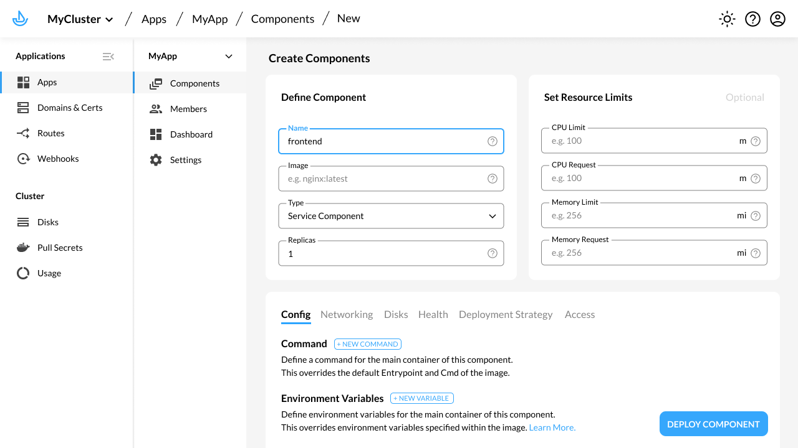

(v2 staging)

Kubernetes is powerful but hard to use. It is not uncommon for teams to have to first spend weeks writing internal tools and yaml configurations before getting a satisfactory Kubernetes setup. Kalm is a suite of open-source tools that makes it easier for you to quickly setup a working Kubernetes production environment. Key features include:

- **Web UI for common operations:** create and update deployments, networks, environment variables, configs and secrets, and problems, all from a web interface.
- **SSO & Membership:** Invite team members to a cluster and allow them to authenicate via SSO. Setup permission rules(view/edit/owner) for users and groups.
- ** HTTPS Certification:** Setup HTTPS certification and auto-renewal with a few clicks, including wildcard certificates.
- **Traffic Management:** Kalm allows you to route traffic from multiple domains/sub-domains to one or or target deployments. Easy start servicing external traffic, or setup more advanced schemes such as as blue-green and canary deployments.
- ** Webhooks:** Kalm let's you update or roll-back deployments via webhooks. This is useful in quickly integrate with CI/CD tools such as Github Actions or CircleCI.

Kalm is a standard [Kubernetes controller](https://kubernetes.io/docs/concepts/architecture/controller/) that can be installed onto any Kubernetes cluster(v1.15+), including Amazon EKS and Google GKE. Think of it as a special app that helps you manage the rest of your apps and workflows.

Although Kalm extends the [Kubernetes API](https://kubernetes.io/docs/concepts/overview/kubernetes-api/) and is accessible via `kubectl`, a core goal of the project is to provide an intuitive UI to make common tasks easier for teams of developers.

If you have a running Kubernetes cluster, you can install Kalm and try out the [Getting Started](get-started) tutorial.
