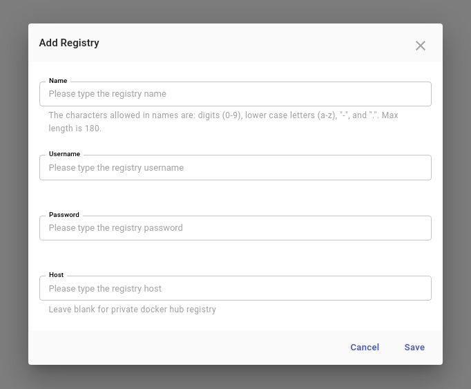

If your images resides in a private registry, you must configure permissions, or else you'll get a `PullImageError` when deploying applications.

Kalm can help you simplify the process of configuring Private Image Registries.

## Example Usage

Let's upload an image to a private dockerhub registry.

Note: you get <a href="https://docs.docker.com/docker-hub/repos/#private-repositories" target="_blank">a free private repo</a> on Docker Hub, which you can use to follow along for this example.

First upload the `busybox` image onto our preo repository. Replace `<MYREPO>` with the name of your private repo.

```
docker pull busybox
docker tag busybox:latest <MYREPO>/private-busybox:latest
docker push <MYREPO>/private-busybox:latest
```

Now let's create a new application with a component using this private image

- Create an Application
- Create a component with `<MYREPO>/private-busybox:latest` as the image
- Click **Deploy**

You should get a "Failed to pull Image..." error.


This error is expected because the pod does not have permission to pull the image.

### Adding a Private Repository

We can fix the issue by adding a private registry.

- Click **Registries** in the left navigation sidebar
- Click **Add Registry**
- Enter username and password for your repository. The host can be blank if you are using hub.docker.com, otherwise enter the full URL(i.e https://gcr.io)

- Press **Save**



If the login info is correct, you should see Verified checkbox light up shortly.


### Redeploy

Now let's redeploy our application.

Go back to the component and delete the failing pod. Deleting a pod will trigger a redeployment. This time, the pod should be successfully deployed.
