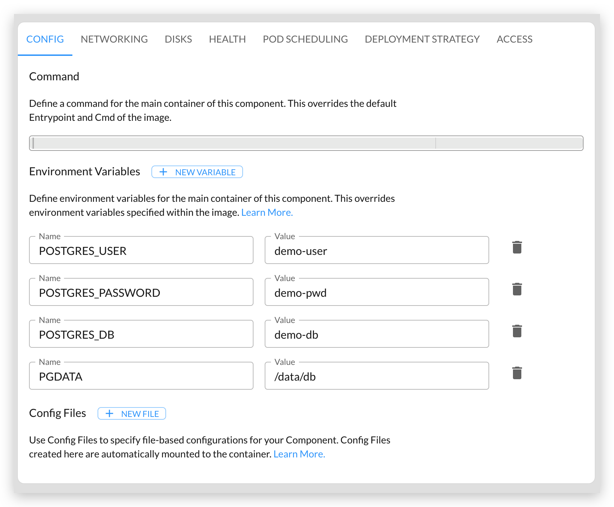
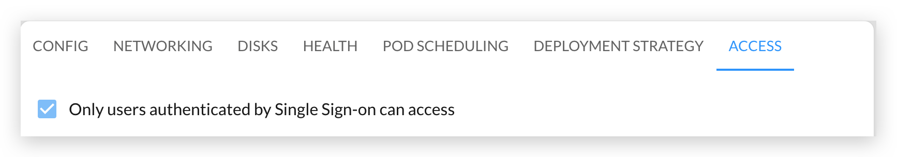
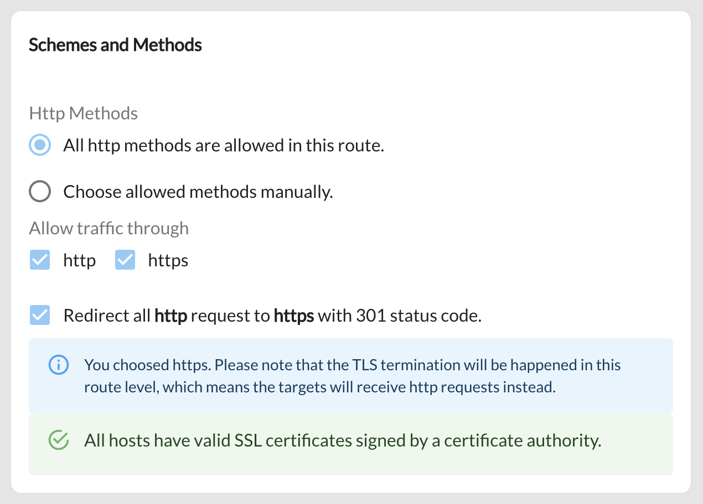

This tutorial shows you how to install [Hasura](https://hasura.io/) on Kalm, and expose the dashboard only to users in your organization.

## Objectives

- Deploy Hasura on Kalm as an Component
- Protect the Hasura dashboard: only authenticated users can visit it

## Before you begin

- You'll need a Kubernetes cluster with Kalm installed (You'll need SSO configured through Kalm as well)

## (Optional)Deploy Postgres DB

Skip this section if you already have a Postgres DB available in your cluster.

This demo will require a Postgres Database - this step will help you set one up through Kalm.

We'll use image: `postgres:10-alpine`:


Add the following environment variables:



Then expose the DB at port 5432:


Use a 1Gi disk for the database:


The YAML below is the equivalent result of our configurations above.

_Note that your storageClass can be different than the yaml file below depending on what Kubernetes service you're using. If you want to try installing by applying a yaml file instead of following the steps above, you may need to update the storageClass field._

```yaml
apiVersion: v1
kind: Namespace
metadata:
  labels:
    istio-injection: enabled
    kalm-enabled: "true"
  name: hasura
---
apiVersion: core.kalm.dev/v1alpha1
kind: Component
metadata:
  name: pg
  namespace: hasura
spec:
  image: postgres:10-alpine
  replicas: 1
  workloadType: server
  env:
  - name: POSTGRES_USER
    type: static
    value: demo-user
  - name: POSTGRES_PASSWORD
    type: static
    value: demo-password
  - name: POSTGRES_DB
    type: static
    value: demo-db
  - name: PGDATA
    type: static
    value: /data/db
  ports:
  - containerPort: 5432
    protocol: tcp
    servicePort: 5432
  volumes:
  - path: /data
    size: 1Gi
    storageClassName: gp2
    type: pvc
  resourceRequirements:
    limits:
      cpu: 200m
      memory: 256Mi
    requests:
      cpu: 200m
      memory: 256Mi
```

## Deploy Hasura

Create an application and component to use for Hasura. Then configure the component as follows:

Use this image: `hasura/graphql-engine:v2.0.0-alpha.2`:


Add the following environment variables:


Next, expose the service at port 8080:


Next, you'll want to protect this dashboard so that only authenticated users (via the Kalm SSO) can view it. You can do this by checking the "Only users authenticated by Single Sign-on can access" box under the **ACCESS** tab: 



The corresponding YAML file to do this is shown below:

```yaml
apiVersion: v1
kind: Namespace
metadata:
  labels:
    istio-injection: enabled
    kalm-enabled: "true"
  name: hasura
---
apiVersion: core.kalm.dev/v1alpha1
kind: Component
metadata:
  name: hasura
  namespace: hasura
spec:
  image: hasura/graphql-engine:v2.0.0-alpha.2
  workloadType: server
  replicas: 1
  env:
  - name: HASURA_GRAPHQL_ENABLE_CONSOLE
    type: static
    value: "true"
  - name: HASURA_GRAPHQL_DEV_MODE
    type: static
    value: "true"
  - name: HASURA_GRAPHQL_DATABASE_URL
    type: static
    value: 'postgres://demo-user: demo-password@pg:5432/demo-db'
  ports:
  - containerPort: 8080
    protocol: http
    servicePort: 8080
  resourceRequirements:
    limits:
      cpu: 200m
      memory: 128Mi
    requests:
      cpu: 100m
      memory: 128Mi
---
apiVersion: core.kalm.dev/v1alpha1
kind: ProtectedEndpoint
metadata:
  name: component-hasura
  namespace: hasura
spec:
  groups: ##todo fix
  - kalmhq
  name: hasura
```

## Setup HttpRoute

Next you'll want to setup a "Route" for Hasura, so that it can be viewed in your browser.

Head over to the Routes tab and create a New Route.

You can choose a subdomain for your Hasura service here:


_Note - you can add new domains easily in the Domains & Certs tab. Or you can use a default domain created by Kalm_

HTTPS is also ready, so check the box:



Our target is what we want this domain to route to. In this case, select your Hasura component you exposed in the previous step.


The corresponding YAML is shown below. Note that your domain will be different.

```yaml
apiVersion: core.kalm.dev/v1alpha1
kind: HttpRoute
metadata:
  name: http-route-for-hasura
spec:
  destinations:
  - host: hasura.hasura.svc.cluster.local:8080
    weight: 1
  hosts:
  - hasura.UPDATE-THIS.clusters.kalm-apps.com
  httpRedirectToHttps: true
  methods:
  - GET
  - POST
  - PUT
  - PATCH
  - DELETE
  - HEAD
  - OPTIONS
  - CONNECT
  - TRACE
  paths:
  - /
  schemes:
  - http
  - https
```

## Try it out

Go back to your application that contains the Hasura Component to verify that your Hasura service is up now. If everything works as expected, you should see the green light on the page:


Now if you visit the domain your have configured (you can just click the domain directly from the Routes tab) you should see the Hasura dashboard up running!


To ensure the access protection is working, open a Private Browser window, and enter the dashboard page again, you should be redirected to a page that asks you to login first.

## Clean Up

If you want to delete your work here, simply delete the Hasura app within the Kalm dashboard. To delete the DB disk, go to the Disks tab, and delete the disk there.
