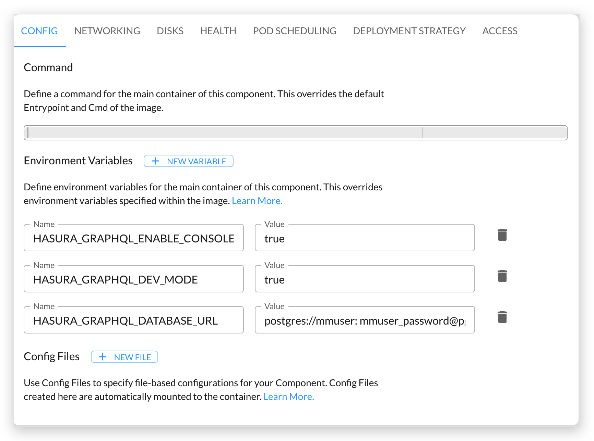

This tutorial shows you how to install [Hasura](https://hasura.io/) on Kalm, and expose the dashboard only to users in your organization.

## Objectives

- Deploy Hasura on kalm as an Component
- Protect the Hasura dashboard, only authenticated users can visit it

## Before you begin

- your should setup a Kalm cluster at Kalm SaaS

## (Optional)Deploy Postgres DB

Skip this section if you already have a Postgres DB available in cluster.

We setup this Database for demo purpose.

We use image: `postgres:10-alpine`:


We configure the DB using ENVs:


We expose the db at port 5432:


and we ask for a 1Gi disk for our database:


The YAML below is the equivalent result of our configurations above.

Notice that your storageClass can be different, update the field if you want to install by applying the YAML file.

```yaml
apiVersion: v1
kind: Namespace
metadata:
  labels:
    istio-injection: enabled
    kalm-enabled: "true"
  name: hasura
---
apiVersion: core.kalm.dev/v1alpha1
kind: Component
metadata:
  name: pg
  namespace: hasura
spec:
  image: postgres:10-alpine
  replicas: 1
  workloadType: server
  env:
  - name: POSTGRES_USER
    type: static
    value: demo-user
  - name: POSTGRES_PASSWORD
    type: static
    value: demo-password
  - name: POSTGRES_DB
    type: static
    value: demo-db
  - name: PGDATA
    type: static
    value: /data/db
  ports:
  - containerPort: 5432
    protocol: tcp
    servicePort: 5432
  volumes:
  - path: /data
    size: 1Gi
    storageClassName: gp2
    type: pvc
  resourceRequirements:
    limits:
      cpu: 200m
      memory: 256Mi
    requests:
      cpu: 200m
      memory: 256Mi
```

## Deploy Hasura

Configurations to install Hasura is similar.

We use image: `hasura/graphql-engine:v2.0.0-alpha.2`:


and add some configurations using ENV:



We expose the service at port 8080:


Since we don't want anyone can visit this dashboard, we add protection on this component by checking the "Only users authenticated by Single Sign-on can access" box under the **ACCESS** tab: 


The YAML file would be look as follows:

```yaml
apiVersion: v1
kind: Namespace
metadata:
  labels:
    istio-injection: enabled
    kalm-enabled: "true"
  name: hasura
---
apiVersion: core.kalm.dev/v1alpha1
kind: Component
metadata:
  name: hasura
  namespace: hasura
spec:
  image: hasura/graphql-engine:v2.0.0-alpha.2
  workloadType: server
  replicas: 1
  env:
  - name: HASURA_GRAPHQL_ENABLE_CONSOLE
    type: static
    value: "true"
  - name: HASURA_GRAPHQL_DEV_MODE
    type: static
    value: "true"
  - name: HASURA_GRAPHQL_DATABASE_URL
    type: static
    value: 'postgres://demo-user: demo-password@pg:5432/demo-db'
  ports:
  - containerPort: 8080
    protocol: http
    servicePort: 8080
  resourceRequirements:
    limits:
      cpu: 200m
      memory: 128Mi
    requests:
      cpu: 100m
      memory: 128Mi
---
apiVersion: core.kalm.dev/v1alpha1
kind: ProtectedEndpoint
metadata:
  name: component-hasura
  namespace: hasura
spec:
  groups: ##todo fix
  - kalmhq
  name: hasura
```

## Setup HttpRoute

Let's setup a route for our Hasura service.

Thanks to Kalm SaaS, a domain is prepared for each kalm cluster.

We choose a subdomain for our Hasura service:


HTTPS is also ready, so let's check it:


We choose our Hasura service as the target:


The YAML would be like as follows, of course your domain will be different, update it in case you wanna apply the YAML.

```yaml
apiVersion: core.kalm.dev/v1alpha1
kind: HttpRoute
metadata:
  name: http-route-for-hasura
spec:
  destinations:
  - host: hasura.hasura.svc.cluster.local:8080
    weight: 1
  hosts:
  - hasura.UPDATE-THIS.clusters.kalm-apps.com
  httpRedirectToHttps: true
  methods:
  - GET
  - POST
  - PUT
  - PATCH
  - DELETE
  - HEAD
  - OPTIONS
  - CONNECT
  - TRACE
  paths:
  - /
  schemes:
  - http
  - https
```

## Check if everything works

Go to the Component detail page to check if your Hasura service is up now. If everything works as expected, you should see the green light on the page:


Now visit the domain your have configured and you should see the Hasura dashboard up running:


To ensure the access protection is working, open a Private Browser window, and enter the dashboard page again, you should be redirected to a page that ask you to login first.

## Clean Up

For clean up, simply delete the hasura app in the Kalm dashboard. To delete the DB disk, go to the Disks page, and delete the disk there.