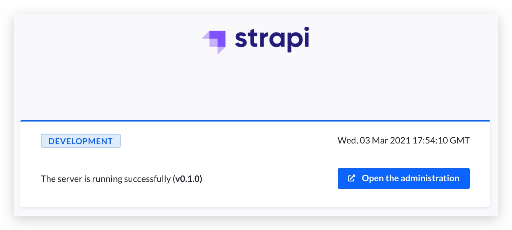

While Kalm provides a quit intuitive dashboard for your daily work, it also supports configuring by applying YAML files. 
In this tutorial, we will show you how to install the headless CMS project: [Strapi](https://strapi.io/) using the YAML way.

## Objectives

- Deploy MongoDB on kalm as an Component
- Deploy Strapi on kalm as an Component

## Before you begin

- your should setup a Kalm cluster at Kalm SaaS

## Deploy MongoDB

We define the DB using Component. For those who are familiar with Deployment, the YAML below should be quit similar.

```yaml
apiVersion: core.kalm.dev/v1alpha1
kind: Component
metadata:
  name: strapi-mongodb
  namespace: strapi
spec:
  image: mongo:4.4.4-bionic
  workloadType: server
  replicas: 1
  env:
  - name: MONGO_INITDB_ROOT_USERNAME
    type: static
    value: admin
  - name: MONGO_INITDB_ROOT_PASSWORD
    type: static
    value: admin
  - name: MONGO_INITDB_DATABASE
    type: static
    value: strapi
  ports:
  - containerPort: 27017
    protocol: tcp
    servicePort: 27017
  resourceRequirements:
    limits:
      cpu: 200m
      memory: 128Mi
    requests:
      cpu: 200m
      memory: 128Mi
  volumes:
  - path: /data/db
    size: 2Gi
    storageClassName: gp2
    type: pvc
  dnsPolicy: ClusterFirst
  restartStrategy: RollingUpdate
  terminationGracePeriodSeconds: 30
```

Let's walk through some key points here.

We use image: `mongo:4.4.4-bionic` to run our DB instance:

```yaml
spec:
  image: mongo:4.4.4-bionic
```

and we initialized the database using Environment variables:

```yaml
spec:
  ...
  env:
  - name: MONGO_INITDB_ROOT_USERNAME
    type: static
    value: admin
  - name: MONGO_INITDB_ROOT_PASSWORD
    type: static
    value: admin
  - name: MONGO_INITDB_DATABASE
    type: static
    value: strapi
```

We expose the db service at port: `27017`:

```yaml
  ports:
  - containerPort: 27017
    protocol: tcp
    servicePort: 27017
```

We also ask for a 2Gi disk for our database:

```yaml
  volumes:
  - path: /data/db
    size: 2Gi
    storageClassName: gp2
    type: pvc
```

:::note
I run this demo on EKS, the storageClassName `gp2` is provided by AWS, on a different platform, this should be different, please update the field accordingly.
:::

# Deploy Strapi

The YAML for Strapi is quit similar:

```yaml
apiVersion: core.kalm.dev/v1alpha1
kind: Component
metadata:
  name: strapi
  namespace: strapi
spec:
  image: strapi/strapi:3.5.2-node12-alpine
  workloadType: server
  replicas: 1
  env:
  - name: DATABASE_CLIENT
    type: static
    value: mongo
  - name: DATABASE_HOST
    type: static
    value: strapi-mongodb
  - name: DATABASE_NAME
    type: static
    value: strapi
  - name: DATABASE_USERNAME
    type: static
    value: admin
  - name: DATABASE_PASSWORD
    type: static
    value: admin
  - name: DATABASE_PORT
    type: static
    value: "27017"
  ports:
  - containerPort: 1337
    protocol: http
    servicePort: 1337
  volumes:
  - path: /srv/app
    size: 2Gi
    storageClassName: gp2
    type: pvc
  resourceRequirements:
    limits:
      cpu: 500m
      memory: 512Mi
    requests:
      cpu: 500m
      memory: 512Mi
```

:::note
- update the ENVs if your db configuration is different
- update the storageClassName if you are on a different cloud platform
:::

# Setup HTTPRoute

Finally let's setup the HTTP route for our Strapi service:

```yaml
apiVersion: core.kalm.dev/v1alpha1
kind: HttpRoute
metadata:
  name: http-route-strapi
spec:
  destinations:
  - host: strapi.strapi.svc.cluster.local:1337
    weight: 1
  hosts:
  - strapi.UPDATE-THIS.clusters.kalm-apps.com
  httpRedirectToHttps: true
  methods:
  - GET
  - POST
  - PUT
  - PATCH
  - DELETE
  - HEAD
  - OPTIONS
  - CONNECT
  - TRACE
  paths:
  - /
  schemes:
  - http
  - https
```

:::note
update your domain for the field: `spec.hosts`.
:::

Some key points:

We route the traffic to the service at `strapi.strapi.svc.cluster.local:1337`:

```yaml
spec:
  ...
  destinations:
  - host: strapi.strapi.svc.cluster.local:1337
    weight: 1
```

The destination is the strapi component we just defined above.

We set our domain in the `spec.hosts` field:

```yaml
spec:
  ...
  hosts:
  - strapi.UPDATE-THIS.clusters.kalm-apps.com
```

HTTPs is ready for clusters initialized by kalm SaaS, so we enable the HTTPS redirect option:

```yaml
  httpRedirectToHttps: true
```

## Check if everything works

Go to the Component detail page to check if your Strapi service is up now. If everything works as expected, you should see the green light on the page:


Now visit the domain your have configured and you should see the admin page up running:



## Clean Up

For clean up, simply delete the app in the Kalm dashboard. To delete the DB disk, go to the Disks page, and delete the disk there.