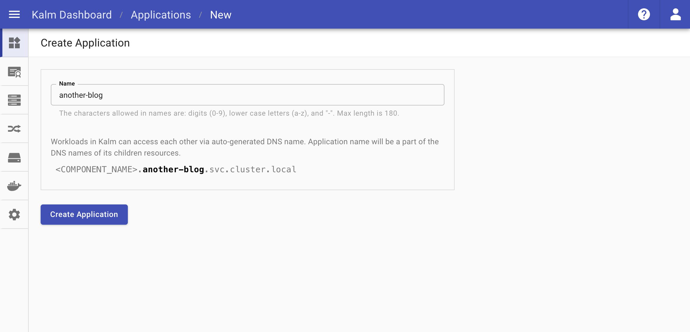
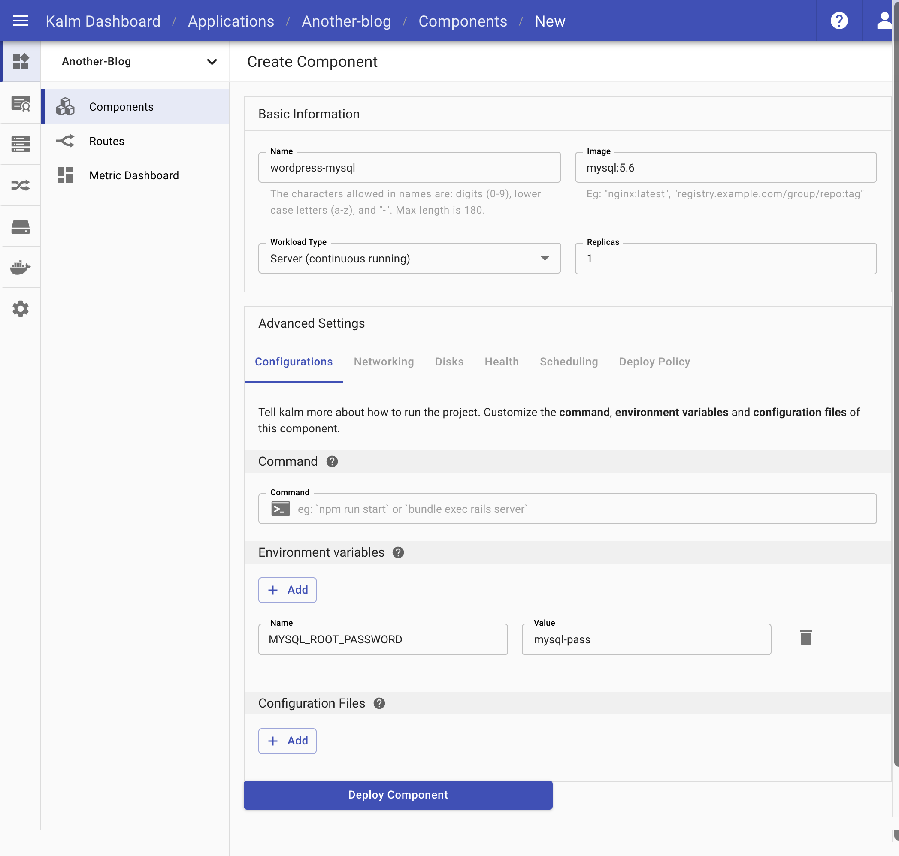
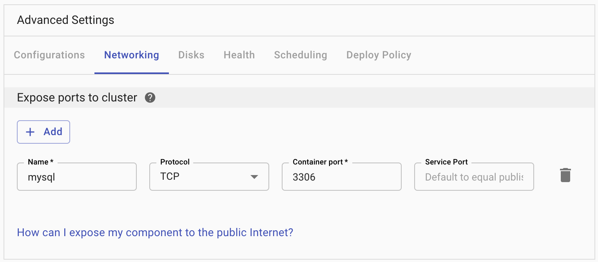
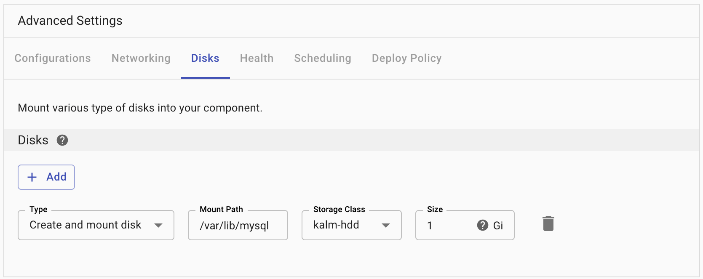
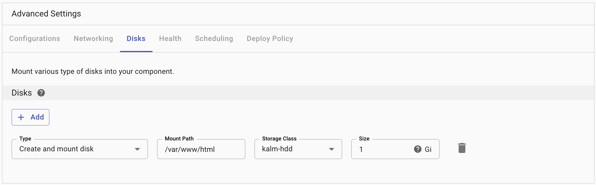
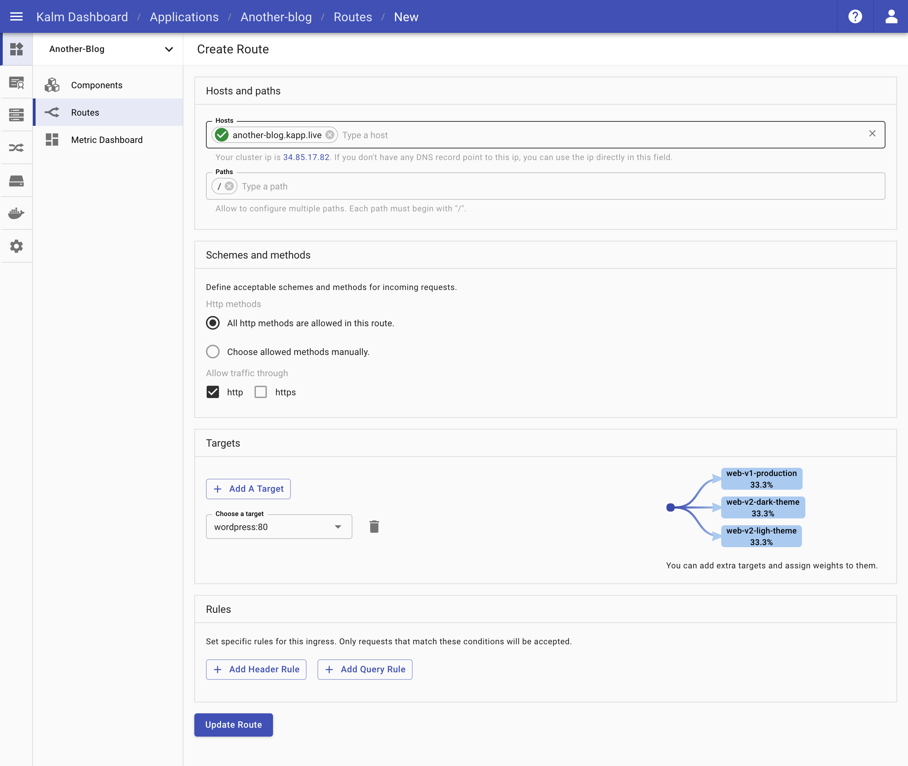
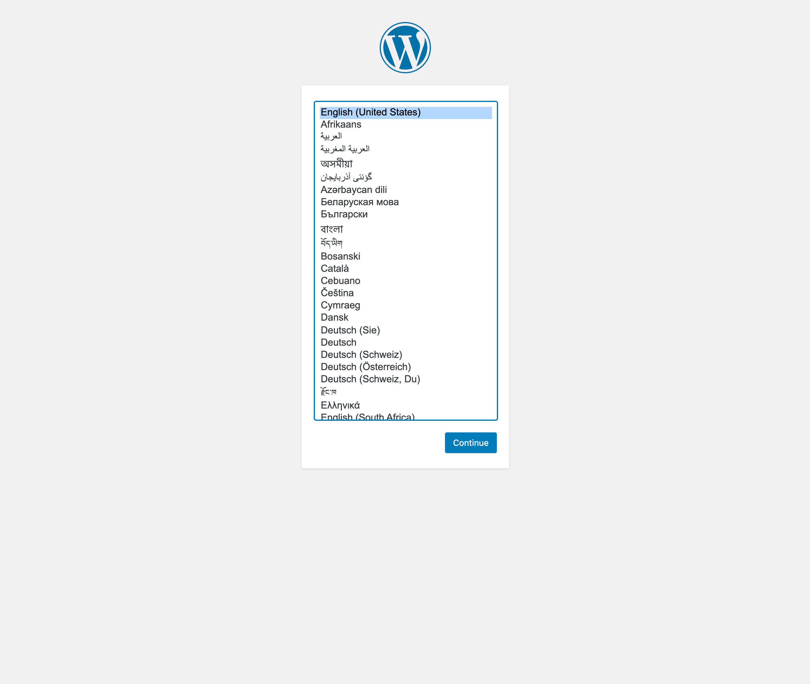

While hosting a blog on Kubernetes might be somewhat of an overkill, it can make for a good learning experience. In this tutorial, let's deploy Wordpress with Kalm in 5 minutes.

## Create New Application

The first thing we need is a new Application for the two components that make up our WordPress site.

- In your Kalm application dashbord, click _Create App_ and enter your application's name

We used the name `another-blog` for this tutorial.

## Add The Database Component

Once you create the application, you'll be prompted to add a component to it. We'll start by adding our Database Component.

- For the component _Name_, enter `wordpress-mysql`
- For the component _Image_, enter `mysql:5.6`

### Configurations

Next we'll move into the _Config_ tab.

- Under Environment Variables, click _+ New Variable_
  - For the _Name_, enter `MYSQL_ROOT_PASSWORD`
  - For the _Value_, enter `mysql-pass`

### Networking

Now we'll expose a Container Port to the cluster so we can access this image. Click the _Networking_ tab.

- Under Ports, click _+ ADD_
  - For the _Protocol_, keep the default `http`
  - For the _Container Port_, enter `3306`
  - You can keep the _Service Port_ blank

### Disks

Lastly, we'll add some storage for this image. Click on the _Disks_ tab.

- Under Disks, click _+ Add_
  - For the _Type_, keep the default `Create and mount disk`
  - For the _Mount Path_, enter `/var/lib/mysql`
  - For the _Storage Class_, keep the default `kalm-hdd`
  - For the _Size_, enter `1Gi`

Click _Deploy Component_ and our pod will start spinning up. While this is deploying, we'll setup our second component.

## Add The Wordpress Component

To add our second component, we'll click _Add Component_ from the Application Components page.

- For the component _Name_, enter `wordpress`
- For the component _Image_, also enter `wordpress`

### Configurations

Once again we'll move to the _Config_ tab. This time we're adding two Environment Variables.

- Under Environment Variables, click _+ New Variable_
  - For the _Name_, enter `MYSQL_ROOT_HOST`
  - For the _Value_, enter `wordpress-mysql`
- Click _+ New Variable_ again to add a second Environment Variable
  - For the _Name_, enter `MYSQL_ROOT_PASSWORD`
  - For the _Value_, enter `mysql-pass`

### Networking

Once again we'll click the _Networking_ tab and expose a container port to the cluster.

- Under Ports click _+ ADD_
  - For the _Protocol_, keep the default `http`
  - For the _Container Port_, enter `80`
  - You can keep the _Service Port_ blank again

### Disks

Again we'll click the _Disks_ tab to add storage for this component.

- Under Disks, click _+ Add_
  - For the _Type_, keep the default `Create and mount disk`
  - For the _Mount Path_, enter `/var/www/html`
  - For the _Storage Class_, keep the default `kalm-hdd`
  - For the _Size_, enter `1Gi`

## Add Route

Lastly, we need to open a Route for our WordPress component so we can access it via a web browser. Click the _Routes_ tab on the left navigation menu.

- Click `Add Route`
  - For _Hosts_, you can either use your own domain or just click the ingress ip quick action (the cluster IP under the Hosts input field)
  - For Targets, click the _Choose a target_ dropdown and select your `wordpress:80` component from the menu.
  - You can leave all of the other options as their defaults
  - Click `Create Route` to create your route

## Rock it!

After a few seconds, all of the components should be up and running and there should be a green checkmark next to your new route.

You can click the domain to open up and play with your new WordPress site!

