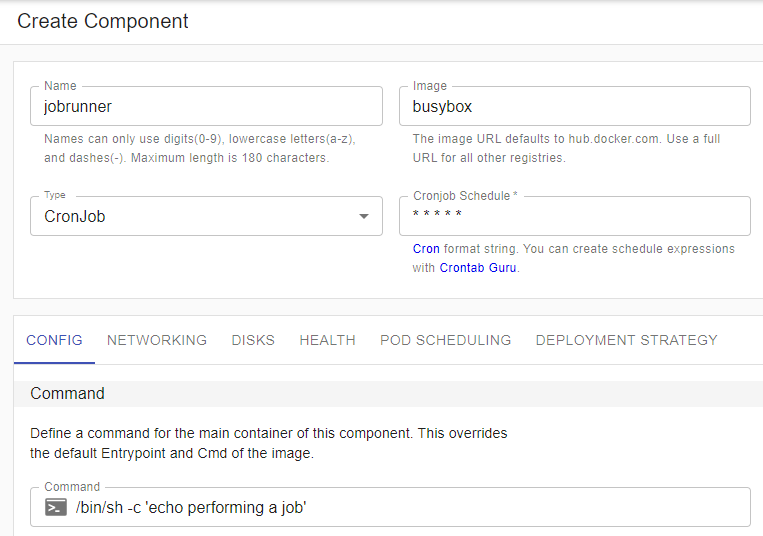
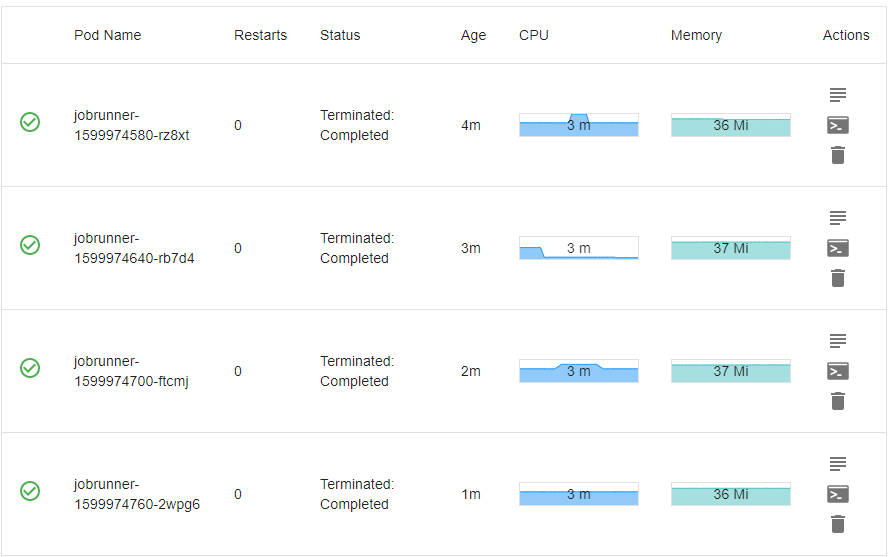

Kubernetes CronJobs run defined tasks on one or more pods which are terminated once the task is over. They can be scheduled to run at specified intervals (e.g. every minute), and are perfect for periodic/recurring tasks (e.g. email notifications, collecting data, etc.).

In this guide, we'll walk you through how to setup a basic Kubernetes CronJob in Kalm.

## Example Container Setup

We'll create a simple application with a recurring component that echos "performing a job" before shutting the pod down.

- create a new Application
- create a new Component
- select `busybox` as the Image
- select `Cronjob` as the Type
- enter `* * * * *` (every minute) for the Cronjob Schedule
- enter `/bin/sh -c 'echo performing a job'` under Config Command

- click `Deploy Component`

Shortly after deploying you will see a list of jobs appearing 1 minute apart, each with a `Terminated: Completed` status

If you click the `logs` action next to each pod, you should see the "performing a job" echoed as expected.
