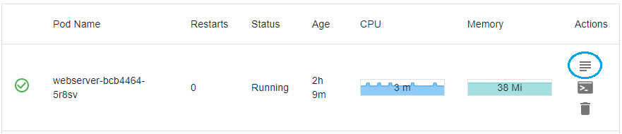
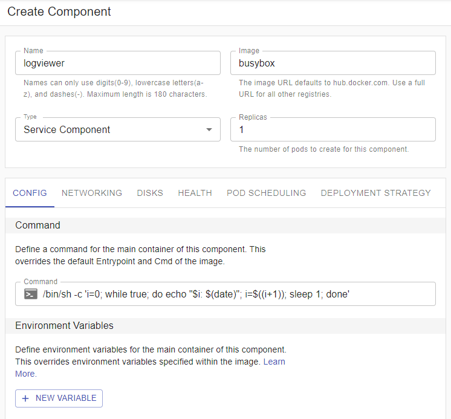
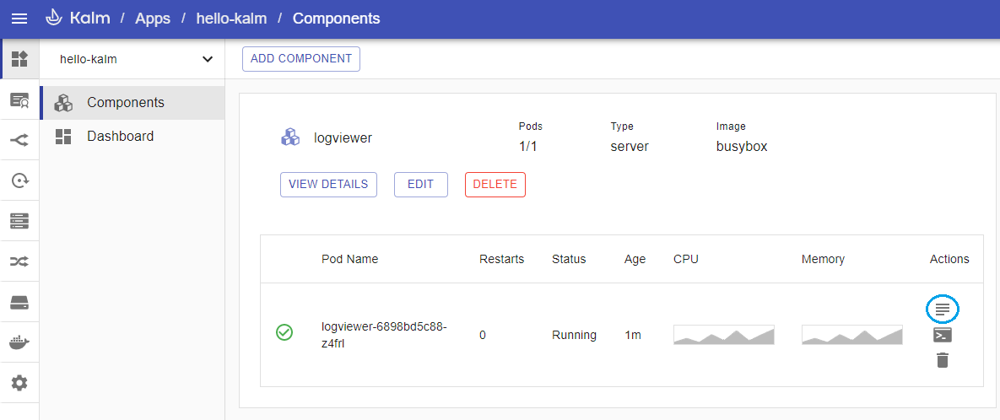
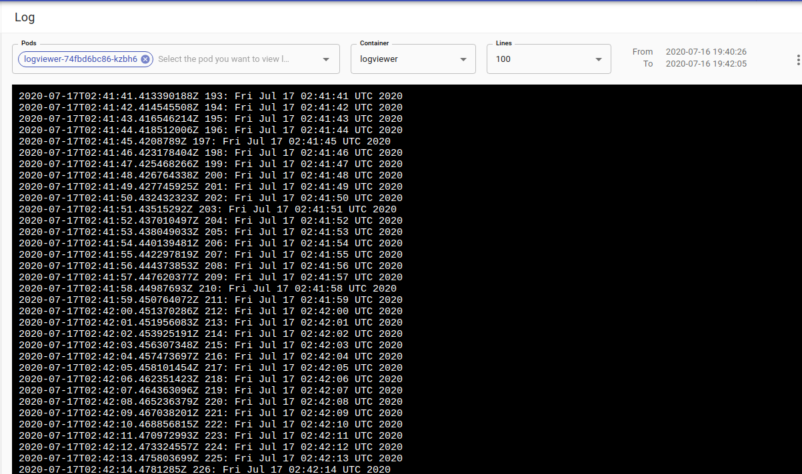

<figure class="video_container">
  <iframe width="560" height="315" src="https://www.youtube.com/embed/zMzWkzxIKlo" frameborder="0" allowfullscreen="true"> </iframe>
</figure>

Sometimes its useful to view the log output of a particular container. You can quickly view logs for any container within Kalm through the log button:



In this guide you will:

- Create an application component that continously logs output
- View the container logs within Kalm

## Example Container Setup

Let's create a container that logs output every second. Create a new application, then add a single Component named **logviewer** with the image set to **busybox**.

In the **Command** input box, enter the following command, which outputs a timestamp every second:

```
/bin/sh -c 'i=0; while true; do echo "$i: $(date)"; i=$((i+1)); sleep 1; done'
```



Click **Deploy Component** to instantiate the component container.

## View Log

After your component is successfully deployed, click the _Log Icon_:



<br />
You should see the Log View:



## Logging System

While it's helpful to view logs for a single container individually as shown above, often you may want to view aggregated logs for multiple containers for specific time periods. For more on setting up a more robust logging system through Kalm, head to our [Logging System](./guide-logging-for-kalm.md) section.
