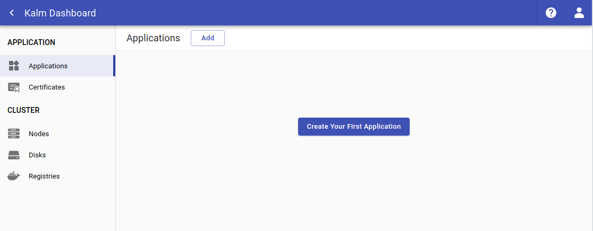

## Create a Service Account

In order to manage applications, Kalm requires _cluster-admin_ privilages on the cluster. To keep things clean, we recommend creating a <a href="https://kubernetes.io/docs/reference/access-authn-authz/service-accounts-admin/" target="_blank">_Service Acount_</a> for Kalm.

To create a service account with cluster-admin privilages:

```bash
kubectl create sa kalm-admin-user
kubectl create clusterrolebinding \
  kalm-admin-binding \
  --user=system:serviceaccount:default:kalm-admin-user \
  --clusterrole=cluster-admin
```

### Retrieve Token

_Note: the following command utilizes jq, a useful json processor which can be found at [https://stedolan.github.io/jq/](https://stedolan.github.io/jq/)_

To use the service account we've just created, we need to retrieve the token

```
KALM_ADMIN_SECRET=$(kubectl get sa kalm-admin-user -o json | jq -r .secrets\[\].name)
KALM_ADMIN_TOKEN=$(kubectl get secret $KALM_ADMIN_SECRET -o json | jq -r '.data["token"]' | base64 -d)
echo $KALM_ADMIN_TOKEN
```

\
You should see a token similar to:


\
Copy the token, paste it into the input field, and press **Login**


You should see the main page


