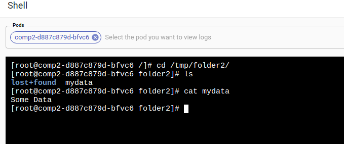

In Kubernetes, volumes are directories avaliable to containers to use as filesystem. Volumes persist beyond the lifecycle of pods.

There are many types of Volumes. Kalm simplifies the typical usecase by representing them as "Disks".

Let's create an application with 2 containers, and share a Disk between them.

- create an application
- create a component called `comp1` with `centos:7` as the image
- one caviat is that containers must have a running process, or it will be terminated immediately after creation. Therefore even though we don't need the container to do anything, we still need to give it a command to stay alive:
- enter `/bin/bash -c 'sleep 100000'` for the command, basically telling it to sleep


Now lets create and mount a disk

- Go to the **Disks** tab
- Click **Add** Disk
- Select `Create and mount disk` in the Type dropdown
- enter `/tmp/folder1` for Mount Path
- select `standard` for Storage Class
- enter `0.1` (Gi) for Size
- click **Update Component**


After the component is created, open a shell and navigate to the mounted disk, and create a file representing application data.

```bash
cd /tmp/folder1
echo "Some Data" > mydata
```

Now let's create a second component, identical to the first one:

- create a second component called `comp2` with `centos:7` as the image
- enter `/bin/bash -c 'sleep 100000'` for the command

This time, let's mount the existing disk we created above with `comp1`

- Go to the **Disks** tab
- Click **Add** Disk
- Select `Mount an existing disk` in the Type dropdown
- enter `/tmp/folder2` for Mount Path
- select the option that starts with `pvc-comp1-...` in the Claim Name dropdown
- click **Update Component**


Let's delete comp1


After comp2 is created, open a shell to the pod and navigate to the mounted disk

```
cd /tmp/folder2
```

Let's check to see if the file we created by shelling into comp1's container exists here

```
cat mydata
```

Hey it seems the data created while we were attached to comp1 (which no longer exists) is avaliable in comp2.



## Recap

In this guide, we created two components attached to the same Disk, and shown that data is shared across the two volumes, and the disk survives the deletion of components.
